## Hi ,

[](https://hesbon.dev/)

🚀 **Software Engineer | Platform & DevOps | Full-Stack Developer | AI & Cybersecurity Enthusiast**

> 🛠️ **New**: [Repository Management Tools](./REPO_MANAGEMENT.md) - Automatically clone and manage all portfolio projects

[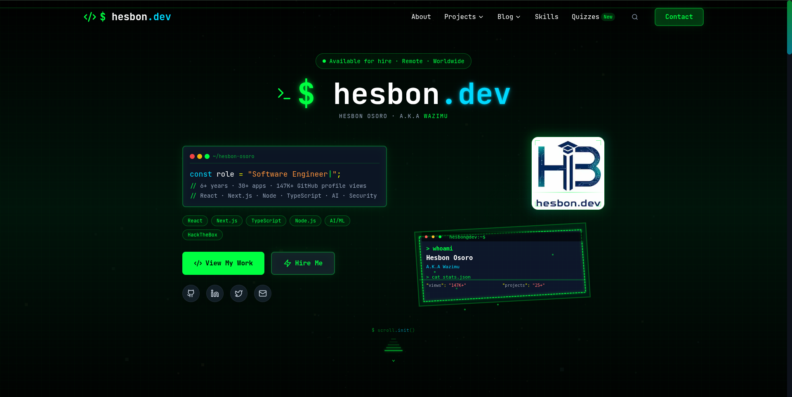](https://hesbon.dev/)

[](https://hesbon.dev/)
[](https://github.com/hesbon-osoro/hesbon-osoro/actions/workflows/ci.yml)

## 👨‍💻 About Me

As a **Software Engineer** with 3+ years in the field, I thrive on the process of transforming complex problems into **impactful, scalable solutions**. My experience spans delivering **production-grade web applications** (featured in [Sample Projects](#sample-projects)), building the **cloud platforms they run on**, and contributing to cutting-edge **AI model training and data enhancement**.

I view every project as a new challenge and a chance to evolve. I collaborate closely with diverse stakeholders to deliver efficient results, always staying updated on the latest trends and sharing my refined solutions with the wider community.

- 🌐 Delivered 30+ production-ready projects (React, Next.js, Node.js, GraphQL, PostgreSQL, MongoDB).
- ☸️ Design containerised services for Kubernetes with Terraform-managed AWS infrastructure and GitHub Actions CI/CD ([see the showcase](#platform-showcase)).
- 🤖 Contributed to AI model training & dataset validation for research and academic projects.
- 🔐 Self-driven in **CompTIA Ethical Hacking** and **HackTheBox** labs.
- 🎓 Background in mathematics, data modeling, and content evaluation.

## 🛠️ Tech Stack

**Languages:** Go, TypeScript, JavaScript, Rust, Python, SQL, Bash  
**Frontend & APIs:** React, Next.js, Node.js, GraphQL, REST  
**Cloud & Platform:** AWS (EKS, ECR, IAM, VPC), Docker, Kubernetes, Kustomize, Terraform  
**DevOps & SRE:** GitHub Actions (OIDC), Prometheus, SLOs & error budgets, Nginx, Linux, Git  
**Databases:** PostgreSQL, MongoDB, MySQL, Firebase  
**Security:** Ethical Hacking (CompTIA), HackTheBox, least-privilege IAM, Pod Security Standards  
**Other:** Academic writing, research, data annotation

<p align="left">
  
  <br />
  
  <br />
  
</p>

<h2 id="platform-showcase">🧰 Platform Engineering Showcase</h2>

Production-style reference code in [`showcase/`](https://github.com/hesbon-osoro/hesbon-osoro/tree/main/showcase), linted, tested, and validated on every push by [CI](https://github.com/hesbon-osoro/hesbon-osoro/actions/workflows/ci.yml).

| Area              | What it demonstrates                                                                                                         | Code                                                                                                                                                                                                       |
| ----------------- | ---------------------------------------------------------------------------------------------------------------------------- | ---------------------------------------------------------------------------------------------------------------------------------------------------------------------------------------------------------- |
| ☸️ **Kubernetes** | Kustomize base + staging/production overlays, zero-downtime rollouts, HPA, PDB, NetworkPolicy, restricted Pod Security, IRSA | [deploy/k8s](https://github.com/hesbon-osoro/hesbon-osoro/tree/main/showcase/deploy/k8s)                                                                                                                   |
| 🐳 **Docker**     | Multi-arch, cache-mounted build producing an ~8 MB distroless, non-root image with a built-in healthcheck                    | [Dockerfile](https://github.com/hesbon-osoro/hesbon-osoro/blob/main/showcase/services/orders-api/Dockerfile)                                                                                               |
| 🏗️ **Terraform**  | AWS VPC + EKS (KMS-encrypted secrets, IMDSv2, access entries), ECR lifecycle rules, keyless GitHub OIDC deploy role          | [infra/terraform](https://github.com/hesbon-osoro/hesbon-osoro/tree/main/showcase/infra/terraform)                                                                                                         |
| 🐹 **Go**         | Orders API with graceful drain for K8s, idempotency keys, Prometheus RED metrics, structured logs, race-tested               | [orders-api](https://github.com/hesbon-osoro/hesbon-osoro/tree/main/showcase/services/orders-api)                                                                                                          |
| 🦀 **Rust**       | Thread-safe keyed token-bucket rate limiter with a deterministic test clock, clippy-pedantic clean                           | [edge-ratelimit](https://github.com/hesbon-osoro/hesbon-osoro/tree/main/showcase/services/edge-ratelimit)                                                                                                  |
| 🟦 **TypeScript** | Retry with full-jitter exponential backoff, abort support, and a half-open circuit breaker                                   | [resilience-ts](https://github.com/hesbon-osoro/hesbon-osoro/tree/main/showcase/services/resilience-ts)                                                                                                    |
| 📈 **SRE**        | Multi-window burn-rate SLO alerts and a Python error-budget release gate                                                     | [observability](https://github.com/hesbon-osoro/hesbon-osoro/tree/main/showcase/deploy/observability) · [slo_budget.py](https://github.com/hesbon-osoro/hesbon-osoro/blob/main/showcase/ops/slo_budget.py) |
| 🚀 **CI/CD**      | GitHub Actions: gofmt/vet/race, clippy, tsc, kubeconform, terraform validate, shellcheck, buildx                             | [ci.yml](https://github.com/hesbon-osoro/hesbon-osoro/blob/main/.github/workflows/ci.yml)                                                                                                                  |
| 🐚 **Bash**       | Digest-pinned deploy with server-side dry run, smoke test and automatic rollback                                             | [deploy.sh](https://github.com/hesbon-osoro/hesbon-osoro/blob/main/showcase/ops/deploy.sh)                                                                                                                 |

<details>
<summary><b>Peek at the code</b></summary>

**Kubernetes: never drop capacity during a rollout, and run locked down**

```yaml
strategy:
  rollingUpdate:
    maxSurge: 25%
    maxUnavailable: 0
template:
  spec:
    securityContext:
      runAsNonRoot: true
      seccompProfile: { type: RuntimeDefault }
    containers:
      - name: orders-api
        readinessProbe: { httpGet: { path: /readyz, port: http } }
        securityContext:
          allowPrivilegeEscalation: false
          readOnlyRootFilesystem: true
          capabilities: { drop: ['ALL'] }
```

**Go: drain before shutdown so Kubernetes stops routing traffic first**

```go
<-ctx.Done()                  // SIGTERM from the kubelet
app.ready.Store(false)        // /readyz -> 503, pod leaves Service endpoints
time.Sleep(cfg.DrainDelay)    // let kube-proxy / ingress catch up
return srv.Shutdown(shutdownCtx) // finish in-flight requests
```

**Terraform: CI deploys to AWS with short-lived OIDC tokens, no stored keys**

```hcl
condition {
  test     = "StringLike"
  variable = "token.actions.githubusercontent.com:sub"
  values = [
    "repo:${var.github_repository}:ref:refs/heads/main",
    "repo:${var.github_repository}:ref:refs/tags/v*",
  ]
}
```

**Docker: distroless, non-root, self-checking**

```dockerfile
FROM gcr.io/distroless/static-debian12:nonroot
COPY --from=build /out/orders-api /orders-api
USER nonroot:nonroot
HEALTHCHECK CMD ["/orders-api", "healthcheck"]
ENTRYPOINT ["/orders-api"]
```

</details>

### 📊 Monthly development breakdown

<!--START_SECTION:waka-->

```txt
From: 08 September 2026 - To: 08 October 2026

Python       17 hrs 19 mins        █████████▒░░░░░░░░░░░░░░░   37.20 %
Markdown     16 hrs 26 mins        ████████▓░░░░░░░░░░░░░░░░   35.28 %
TypeScript   4 hrs 14 mins         ██▒░░░░░░░░░░░░░░░░░░░░░░   09.10 %
HTML         2 hrs 43 mins         █▒░░░░░░░░░░░░░░░░░░░░░░░   05.84 %
Other        1 hr 45 mins          █░░░░░░░░░░░░░░░░░░░░░░░░   03.77 %
```

<!--END_SECTION:waka-->

<!-- prettier-ignore-start -->

<h2 id="sample-projects">📂 Featured Projects</h2>
<table>
  <tbody>
    <tr>
      <td width="50%">
        <a href="https://restaurant-ecommerce.netlify.app/">
          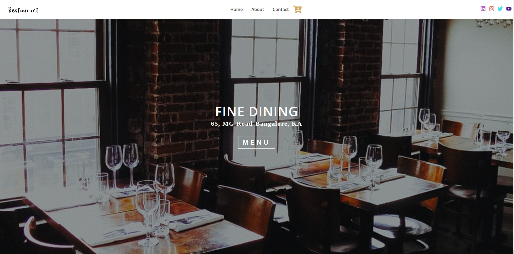
        </a>
        <br />
        <a href="https://restaurant-ecommerce.netlify.app/">Restaurant E-commerce site</a>
        <br />
        <a href="https://github.com/hesbon-osoro/restaurant">
          
        </a>
      </td>
      <td width="50%">
        <a href="https://hampi-tourism-site-hb.netlify.app/">
          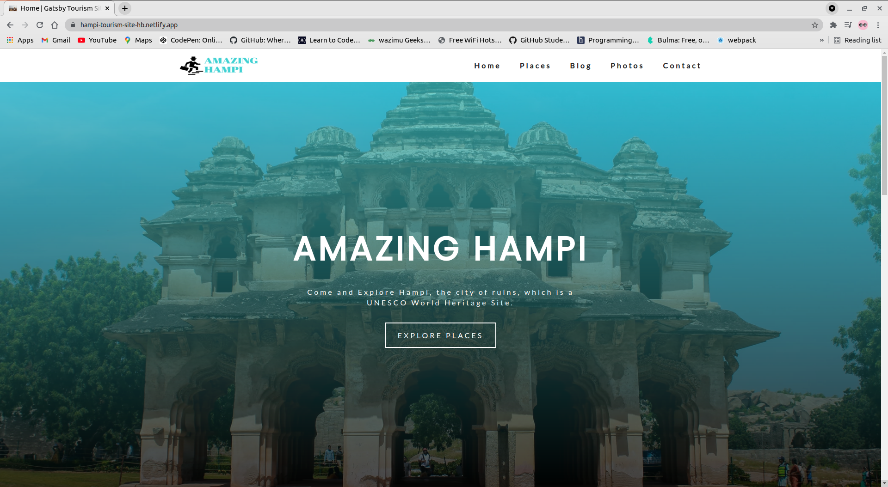
        </a>
        <br />
        <a href="https://hampi-tourism-site-hb.netlify.app/">Tourism Hampi</a>
        <br />
        <a href="https://github.com/hesbon-osoro/tourism-hampi">
          
        </a>
      </td>
    </tr>
    <tr>
      <td width="50%">
        <a href="https://video-app-hb.netlify.app/">
          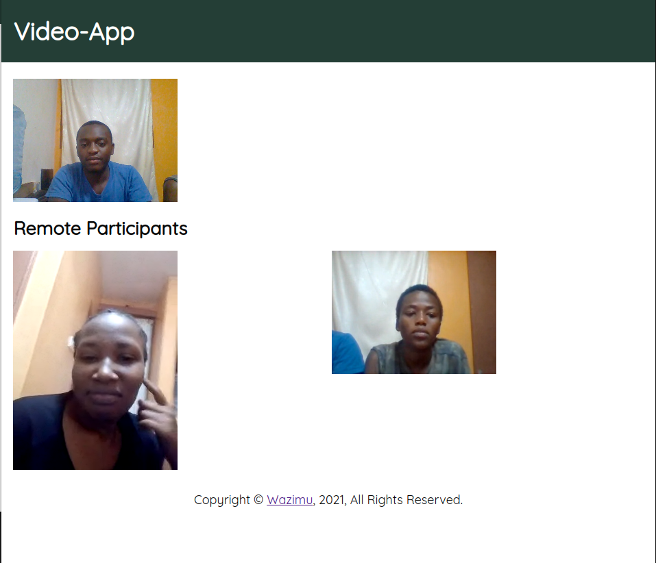
        </a>
        <br />
        <a href="https://video-app-hb.netlify.app/">Video App</a>
        <br />
        <a href="https://github.com/hesbon-osoro/video-app">
          
        </a>
      </td>
      <td width="50%">
        <a href="https://chat-app-merng.netlify.app/">
          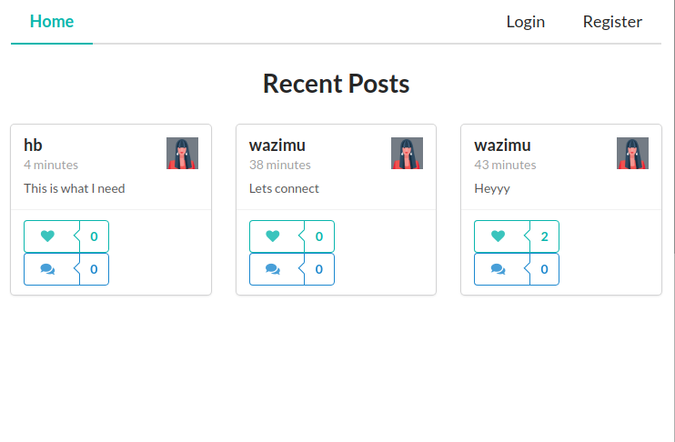
        </a>
        <br />
        <a href="https://chat-app-merng.netlify.app/">Chat App</a>
        <br />
        <a href="https://github.com/hesbon-osoro/chat-app-merng-client">
          
        </a>
      </td>
    </tr>
    <tr>
      <td width="50%">
        <a href="https://dating-site-frontend.netlify.app/">
          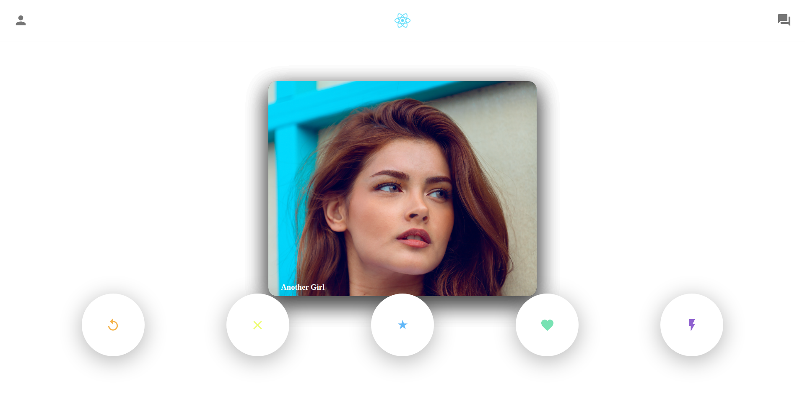
        </a>
        <br />
        <a href="https://dating-site-frontend.netlify.app/">Dating Site</a>
        <br />
        <a href="https://github.com/hesbon-osoro/dating-app-frontend">
          
        </a>
      </td>
      <td width="50%">
        <a href="https://salad-hb.netlify.app/">
          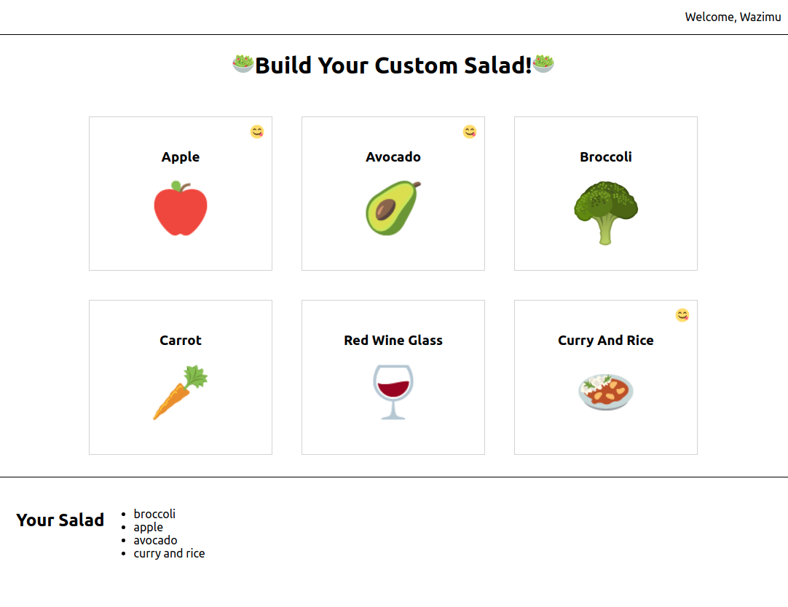
        </a>
        <br />
        <a href="https://salad-hb.netlify.app/">Salad site</a>
        <br />
        <a href="https://github.com/hesbon-osoro/salad">
          
        </a>
      </td>
    </tr>
    <tr>
      <td width="50%">
        <a href="https://agency-site-hb.netlify.app/">
          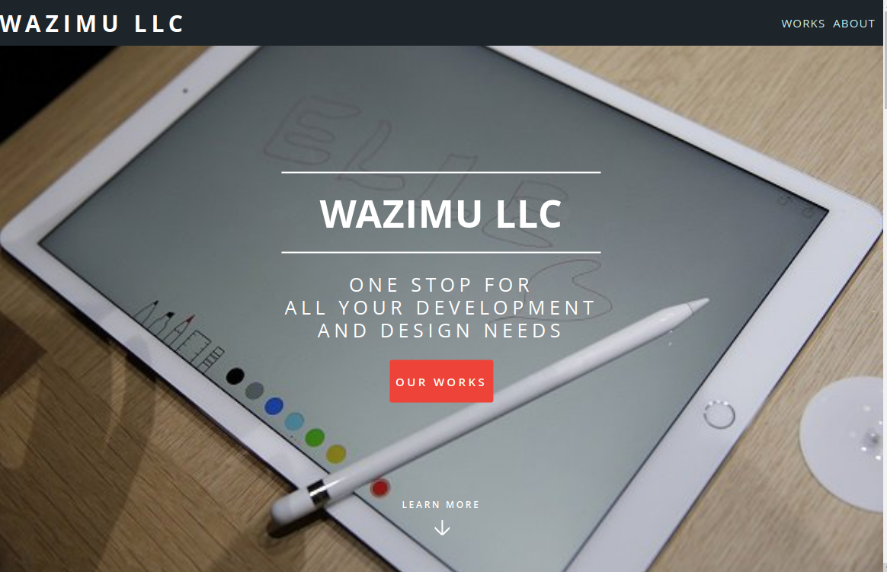
        </a>
        <br />
        <a href="https://agency-site-hb.netlify.app/">Agency Site</a>
        <br />
        <a href="https://github.com/hesbon-osoro/agency-site">
          
        </a>
      </td>
      <td width="50%">
        <a href="https://portfolio-hb.netlify.app/">
          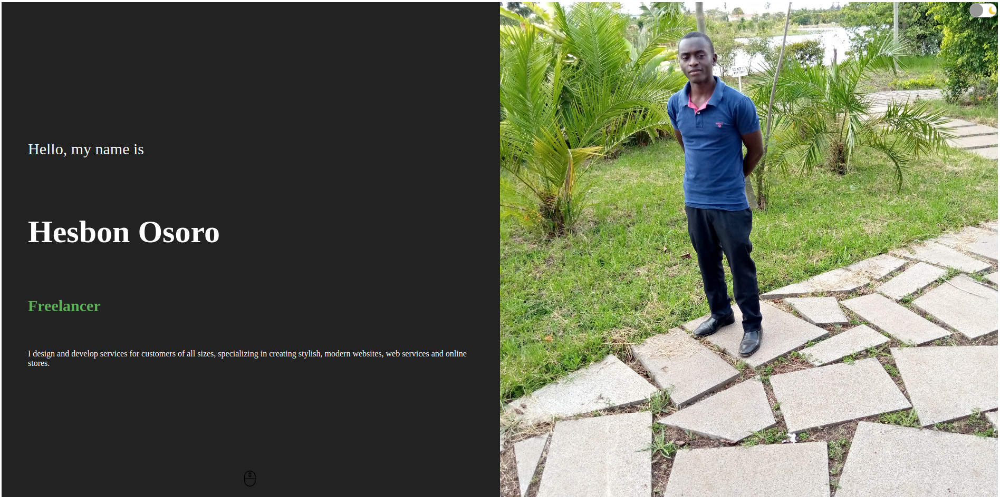
        </a>
        <br />
        <a href="https://portfolio-hb.netlify.app/">Sample Portfolio</a>
        <br />
        <a href="https://github.com/hesbon-osoro/portfolio-hb">
          
        </a>
      </td>
    </tr>
    <tr>
      <td width="50%">
        <a href="https://recipes-homemade-hb.netlify.app/">
          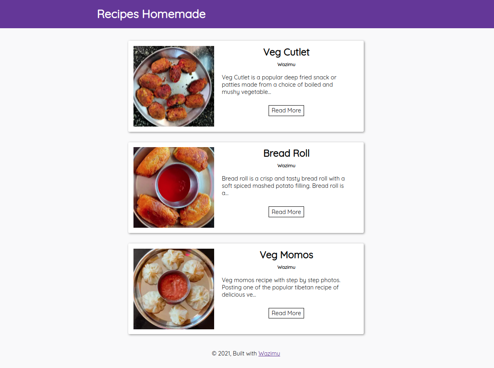
        </a>
        <br />
        <a href="https://recipes-homemade-hb.netlify.app/">Recipes Homemade</a>
        <br />
        <a href="https://github.com/hesbon-osoro/recipes-homemade">
          
        </a>
      </td>
      <td width="50%">
        <a href="https://messaging-app-frontend.web.app/">
          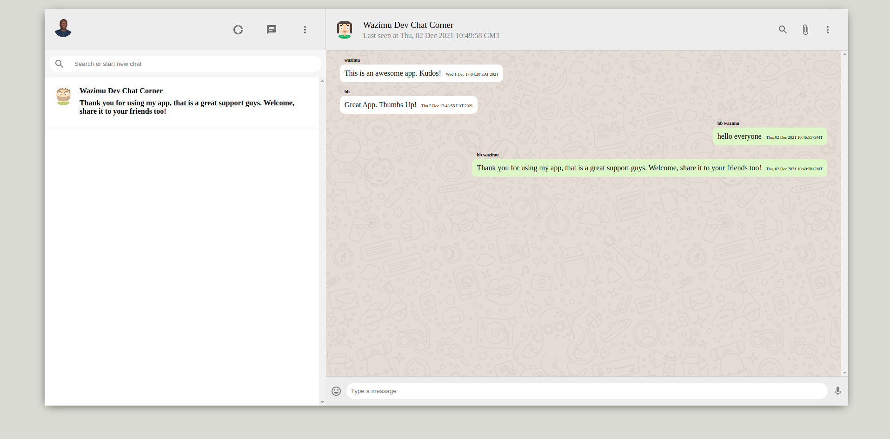
        </a>
        <br />
        <a href="https://messaging-app-frontend.web.app/">Messaging App</a>
        <br />
        <a href="https://github.com/hesbon-osoro/messaging-app-frontend">
          
        </a>
      </td>
    </tr>
    <tr>
      <td width="50%">
        <a href="https://reactjs-shoppy-admin-dashboard.netlify.app/">
          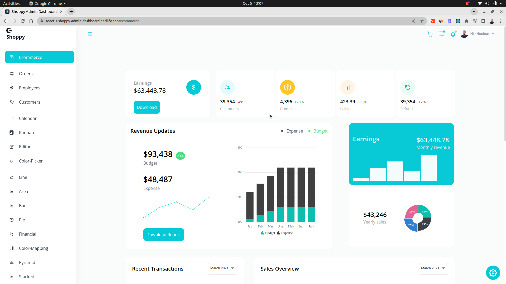
        </a>
        <br />
        <a href="https://reactjs-shoppy-admin-dashboard.netlify.app/">Shoppy Dashboard</a>
        <br />
        <a href="https://github.com/hesbon-osoro/shoppy-admin-dashboard">
          
        </a>
      </td>
      <td width="50%">
        <a href="https://simple-multistep-form.netlify.app/">
          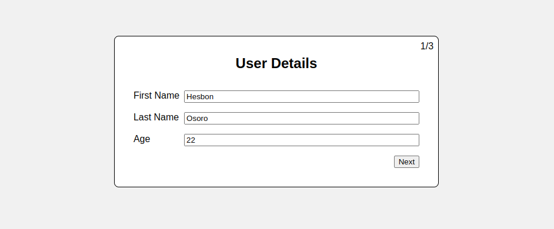
        </a>
        <br />
        <a href="https://simple-multistep-form.netlify.app/">Simple Multi-step form</a>
        <br />
        <a href="https://github.com/hesbon-osoro/simple-multistep-form">
          
        </a>
      </td>
    </tr>
    <tr>
      <td width="50%">
        <a href="https://react-alarm-clock.netlify.app/">
          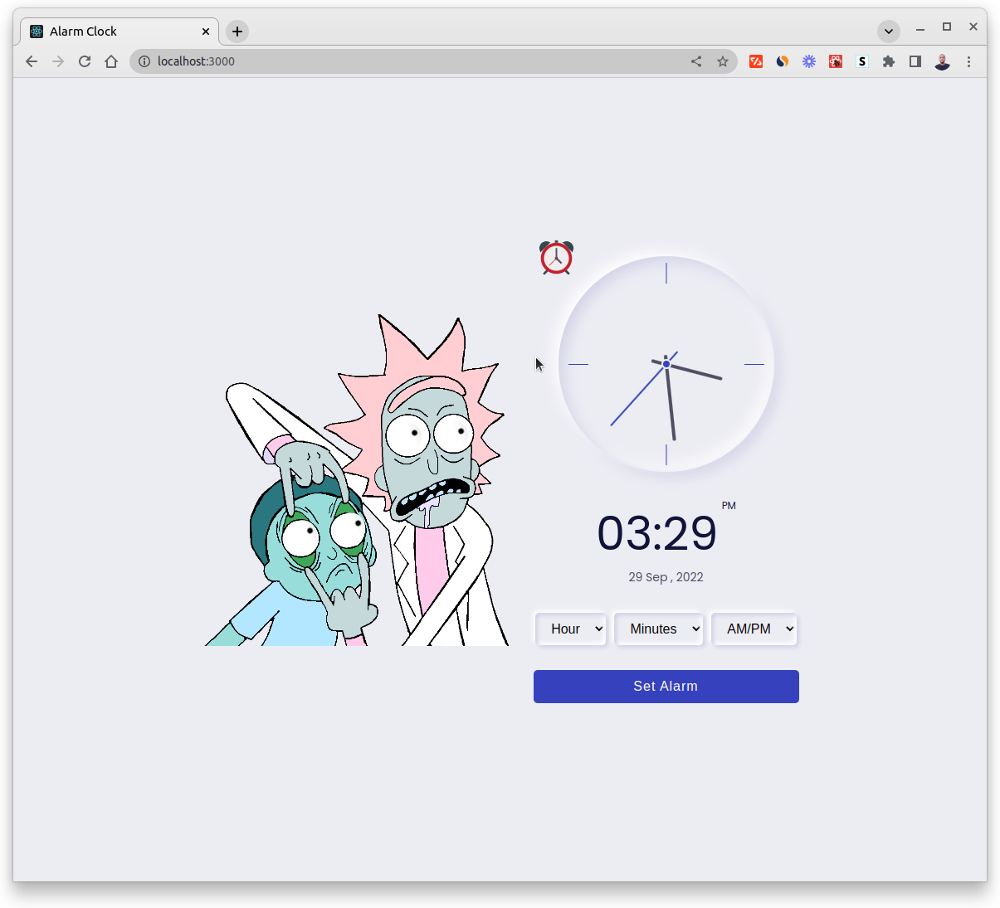
        </a>
        <br />
        <a href="https://react-alarm-clock.netlify.app/">Alarm Clock</a>
        <br />
        <a href="https://github.com/hesbon-osoro/alarm-clock">
          
        </a>
      </td>
      <td width="50%">
        <a href="https://snake-game-ts.netlify.app/">
          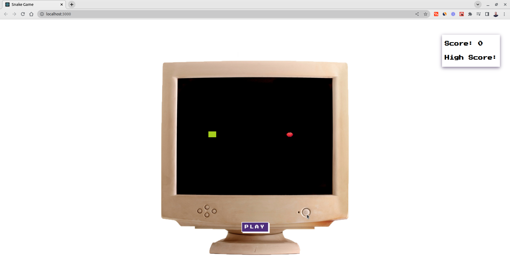
        </a>
        <br />
        <a href="https://snake-game-ts.netlify.app/">Snake Game</a>
        <br />
        <a href="https://github.com/hesbon-osoro/snake-game">
          
        </a>
      </td>
    </tr>
    <tr>
      <td width="50%">
        <a href="https://reactjs-chess.vercel.app/">
          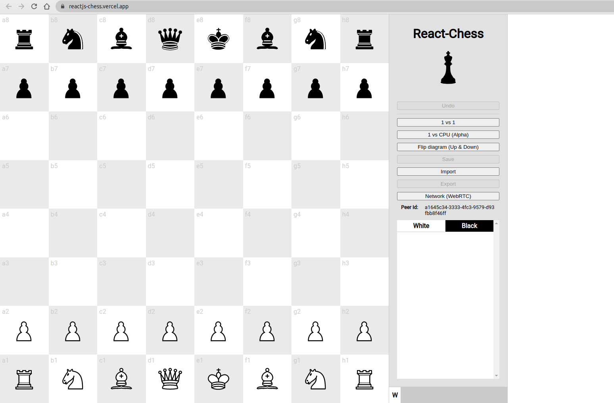
        </a>
        <br />
        <a href="https://reactjs-chess.vercel.app/">React Chess</a>
        <br />
        <a href="https://github.com/hesbon-osoro/react-chess">
          
        </a>
      </td>
      <td width="50%">
        <a href="https://reactjs-sort-visualizer.netlify.app/">
          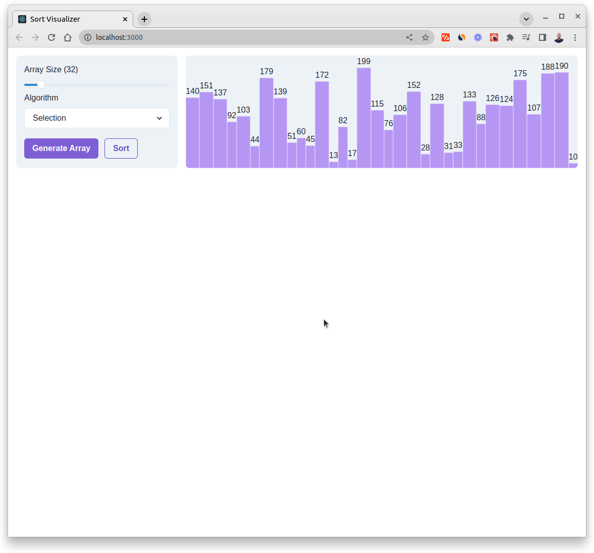
        </a>
        <br />
        <a href="https://reactjs-sort-visualizer.netlify.app/">Sort Visualizer</a>
        <br />
        <a href="https://github.com/hesbon-osoro/sort-visualizer">
          
        </a>
      </td>
    </tr>
    <tr>
      <td width="50%">
        <a href="https://reactts-shopping-cart.netlify.app/">
          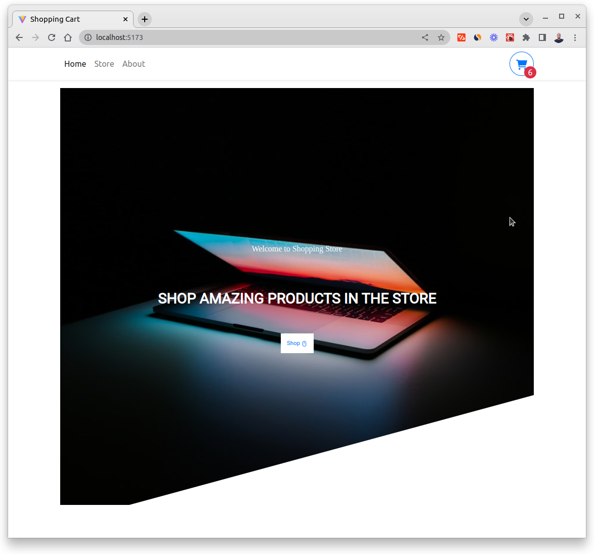
        </a>
        <br />
        <a href="https://reactts-shopping-cart.netlify.app/">Shopping Cart</a>
        <br />
        <a href="https://github.com/hesbon-osoro/shopping-cart">
          
        </a>
      </td>
      <td width="50%">
        <a href="https://custom-pagination-react.netlify.app/">
          
        </a>
        <br />
        <a href="https://custom-pagination-react.netlify.app/">Custom Pagination</a>
        <br />
        <a href="https://github.com/hesbon-osoro/custom-pagination">
          
        </a>
      </td>
    </tr>
    <tr>
      <td width="50%">
        <a href="https://react-custom-select.netlify.app/">
          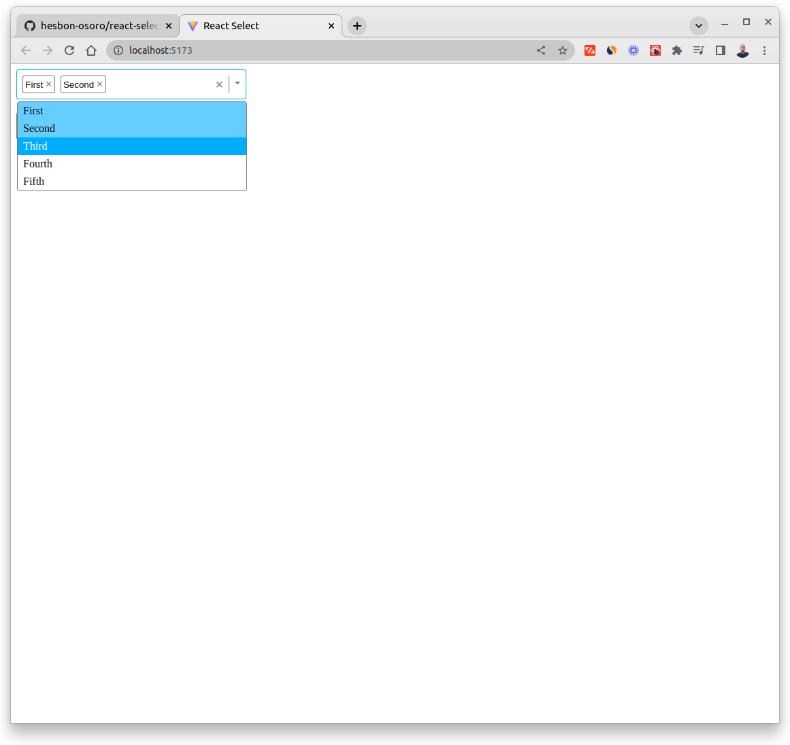
        </a>
        <br />
        <a href="https://react-custom-select.netlify.app/">Custom Select</a>
        <br />
        <a href="https://github.com/hesbon-osoro/react-select">
          
        </a>
      </td>
      <td width="50%">
        <a href="https://reactjs-drag-and-drop.netlify.app/">
          
        </a>
        <br />
        <a href="https://reactjs-drag-and-drop.netlify.app/">Drag and Drop</a>
        <br />
        <a href="https://github.com/hesbon-osoro/drag-and-drop">
          
        </a>
      </td>
    </tr>
    <tr>
      <td width="50%">
        <a href="https://ck-editor-react.netlify.app/">
          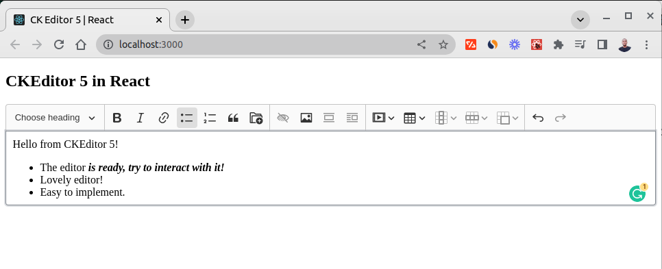
        </a>
        <br />
        <a href="https://ck-editor-react.netlify.app/">CK 5 Editor</a>
        <br />
        <a href="https://github.com/hesbon-osoro/ck-editor-react">
          
        </a>
      </td>
      <td width="50%">
        <a href="https://tic-tac-toe-ts-game.netlify.app/">
          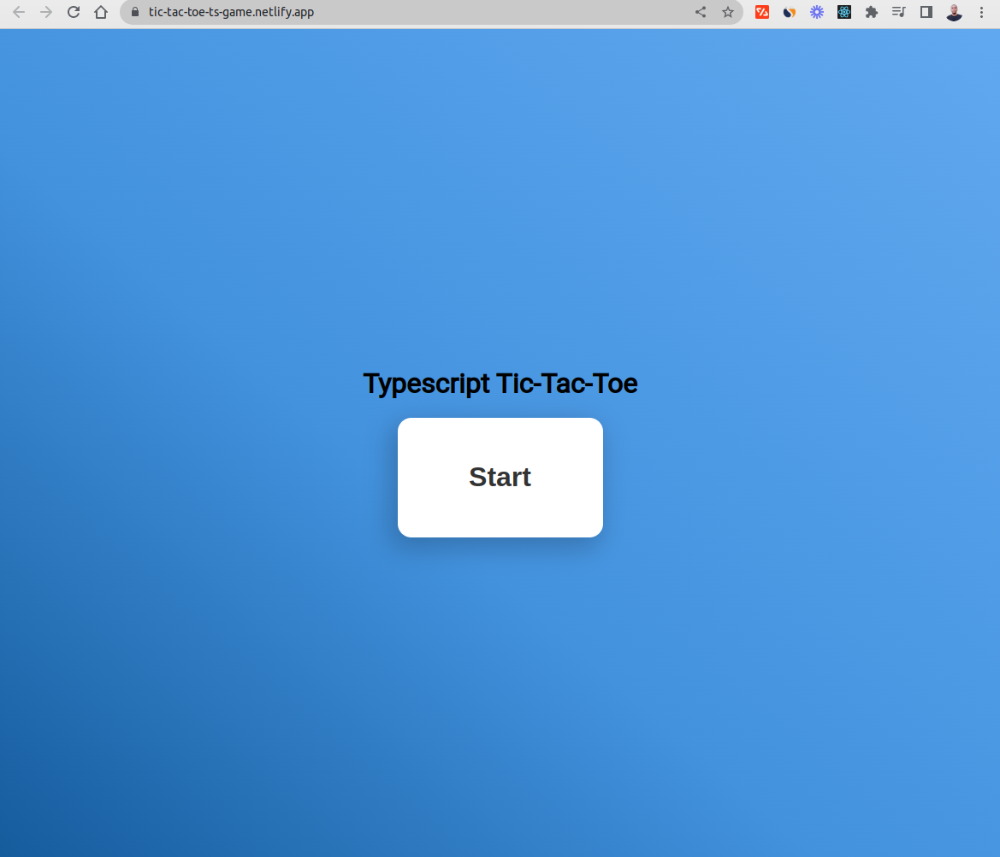
        </a>
        <br />
        <a href="https://tic-tac-toe-ts-game.netlify.app/">Tic Tac Toe</a>
        <br />
        <a href="https://github.com/hesbon-osoro/tic-tac-toe">
          
        </a>
      </td>
    </tr>
    <tr>
      <td width="50%">
        <a href="https://face-auth.netlify.app/">
          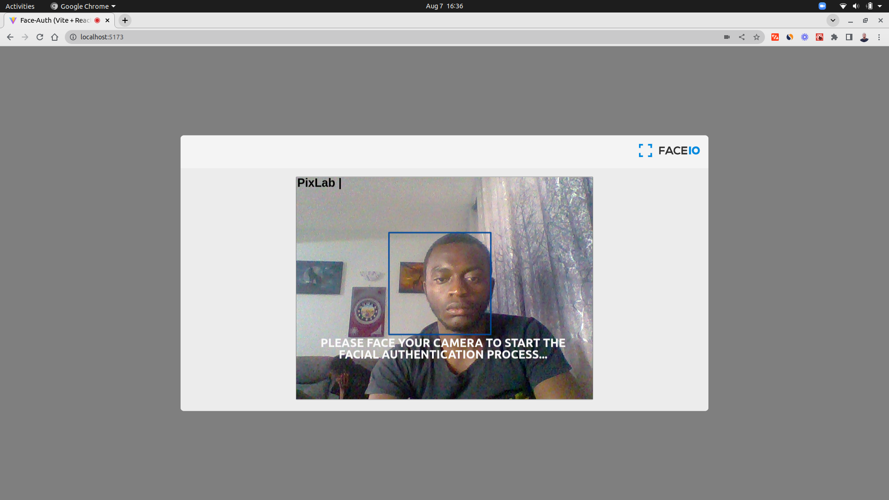
        </a>
        <br />
        <a href="https://face-auth.netlify.app/">Face Auth</a>
        <br />
        <a href="https://github.com/hesbon-osoro/face-auth">
          
        </a>
      </td>
      <td width="50%">
        <a href="https://dynamic-next-previous-buttons.vercel.app/">
          
        </a>
        <br />
        <a href="https://dynamic-next-previous-buttons.vercel.app/">Dynamic Next/Previous buttons</a>
        <br />
        <a href="https://github.com/hesbon-osoro/dynamic-next-previous-buttons">
          
        </a>
      </td>
    </tr>
    <tr>
      <td width="50%">
        <a href="https://nextjs-video-streaming.vercel.app/">
          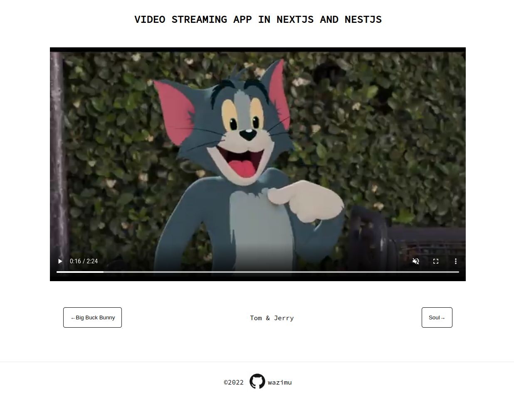
        </a>
        <br />
        <a href="https://nextjs-video-streaming.vercel.app/">Video Stream</a>
        <br />
        <a href="https://github.com/hesbon-osoro/nextjs-video-streaming">
          
        </a>
      </td>
      <td width="50%">
        <a href="https://hesbon-osoro.github.io/MindTap/">
          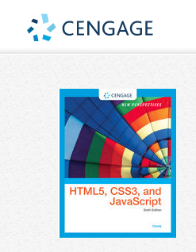
        </a>
        <br />
        <a href="https://hesbon-osoro.github.io/MindTap/">Cengage | MindTap (69 projects)</a>
        <br />
        <a href="https://github.com/hesbon-osoro/MindTap">
          
        </a>
      </td>
    </tr>
    <tr>
      <td width="50%">
        <a href="https://follow-for-follow-back.vercel.app/">
          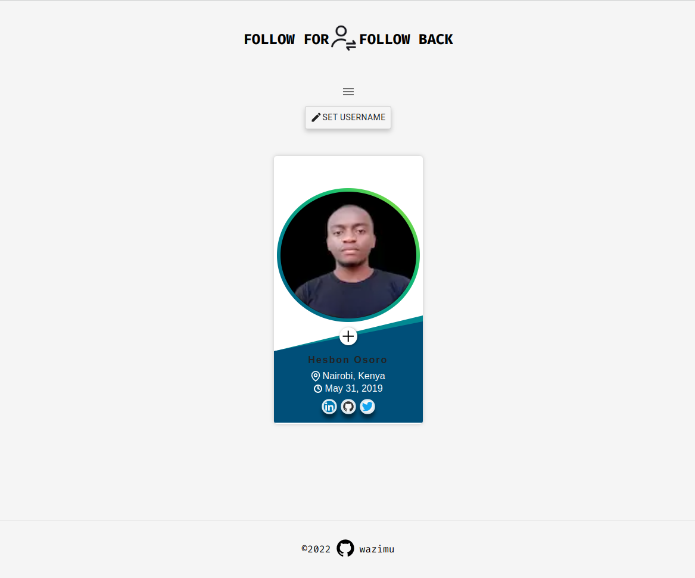
        </a>
        <br />
        <a href="https://follow-for-follow-back.vercel.app/">Follow For Follow Back</a>
        <br />
        <a href="https://github.com/hesbon-osoro/follow-for-follow-back">
          
        </a>
      </td>
      <td width="50%"></td>
    </tr>
    <tr>
      <td colspan="2" align="center">
        CLICK ON THE  ICON TO VIEW THE PROJECT'S REPOSITORY
      </td>
    </tr>
    <tr>
      <td colspan="2" align="center">
        CLICK ON THE PROJECT IMAGE OR THE <a href="#">BLUE LINK</a> TO VISIT THE HOSTED PROJECT
      </td>
    </tr>
  </tbody>
</table>

<!-- prettier-ignore-end -->

<h2 id="certifications">🎓 Certifications</h2>

<!-- prettier-ignore-start -->

<table>
  <tbody>
    <tr>
      <td width="50%">
        <a href="https://www.hackerrank.com/certificates/229ef084f60a">
          
        </a>
        <br />
        <a href="https://www.hackerrank.com/certificates/229ef084f60a">Verify</a>
      </td>
      <td width="50%">
        <a href="https://www.hackerrank.com/certificates/12d1fbc424ce">
          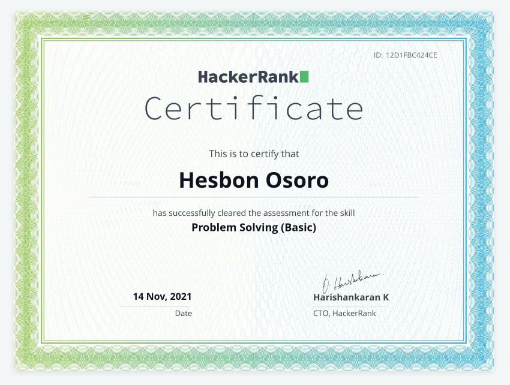
        </a>
        <br />
        <a href="https://www.hackerrank.com/certificates/12d1fbc424ce">Verify</a>
      </td>
    </tr>
    <tr>
      <td width="50%">
        <a href="https://www.codechef.com/certificates/verify">
          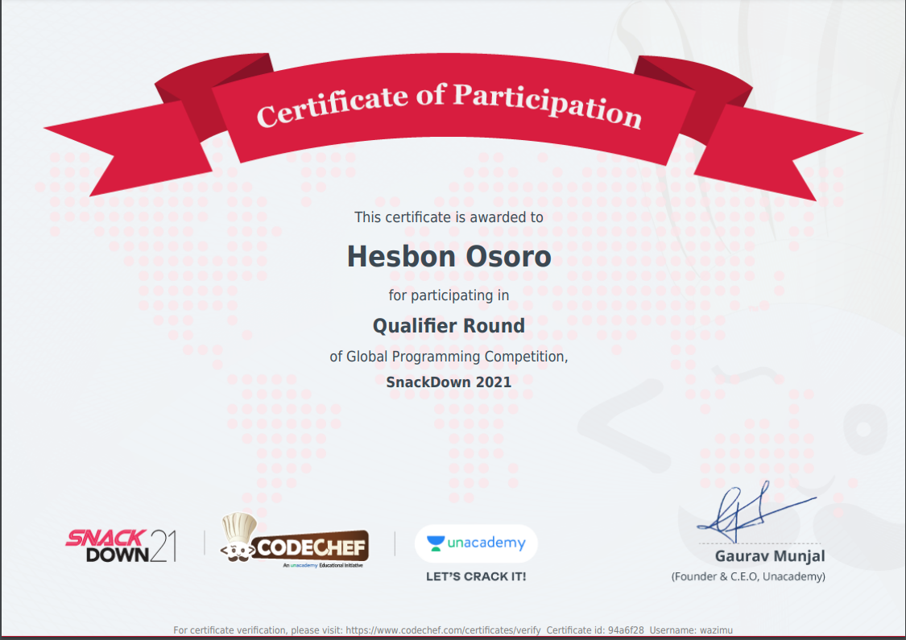
        </a>
        <br />
        <a href="https://www.codechef.com/certificates/verify">Verify</a>
        <p><b>Certificate ID:</b> 94a6f28</p>
        <p><b>Username:</b> wazimu</p>
      </td>
      <td width="50%">
        <a href="https://hb-wazimu.netlify.app/#certification">
          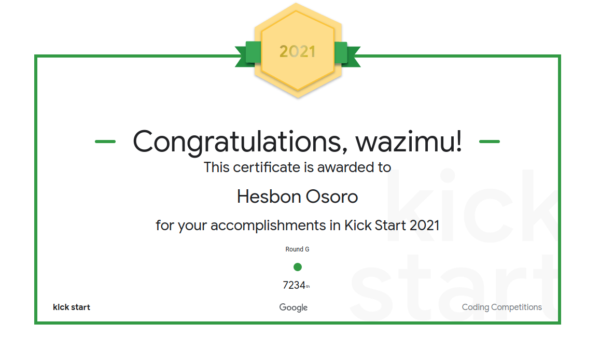
        </a>
        <br />
        <a href="https://hb-wazimu.netlify.app/#certification">Verify</a>
      </td>
    </tr>
    <tr>
      <td width="50%">
        <a
          href="https://www.freecodecamp.org/certification/wazimu/front-end-development-libraries"
        >
          
        </a>
        <br />
        <a
          href="https://www.freecodecamp.org/certification/wazimu/front-end-development-libraries"
          >Verify</a
        >
      </td>
      <td width="50%">
        <a
          href="https://www.freecodecamp.org/certification/wazimu/javascript-algorithms-and-data-structures"
        >
          
        </a>
        <br />
        <a
          href="https://www.freecodecamp.org/certification/wazimu/javascript-algorithms-and-data-structures"
          >Verify</a
        >
      </td>
    </tr>
    <tr>
      <td width="50%">
        <a
          href="https://www.freecodecamp.org/certification/wazimu/responsive-web-design"
        >
          
        </a>
        <br />
        <a
          href="https://www.freecodecamp.org/certification/wazimu/responsive-web-design"
          >Verify</a
        >
      </td>
      <td width="50%">
        <a href="https://hb-wazimu.netlify.app/#certification">
          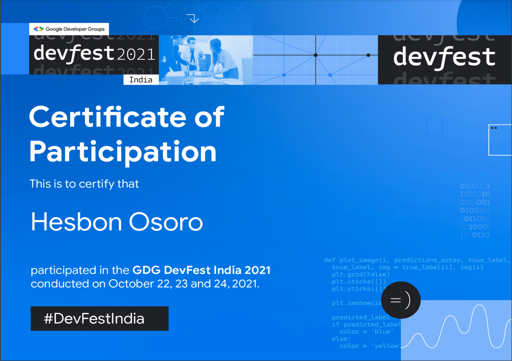
        </a>
        <br />
        <a href="https://hb-wazimu.netlify.app/#certification">Verify</a>
      </td>
    </tr>
    <tr>
      <td width="50%">
        <a href="https://hb-wazimu.netlify.app/#certification">
          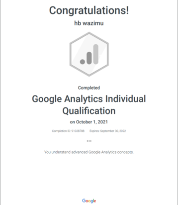
        </a>
        <br />
        <a href="https://hb-wazimu.netlify.app/#certification">Verify</a>
      </td>
      <td width="50%">
        <a href="https://hb-wazimu.netlify.app/#certification">
          
        </a>
        <br />
        <a href="https://hb-wazimu.netlify.app/#certification">Verify</a>
      </td>
    </tr>
    <tr>
      <td width="50%">
        <a href="https://hb-wazimu.netlify.app/#certification">
          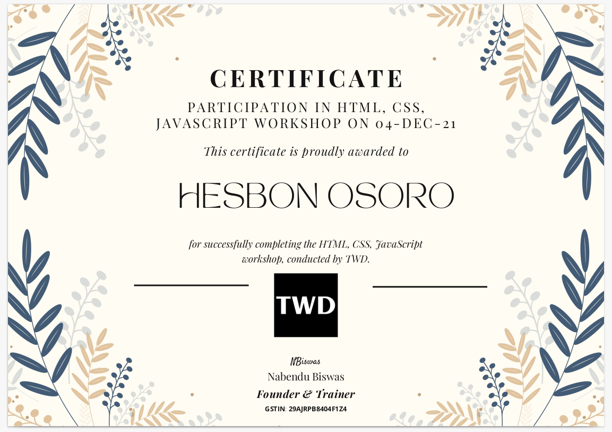
        </a>
        <br />
        <a href="https://hb-wazimu.netlify.app/#certification">Verify</a>
      </td>
      <td width="50%">
        <a href="https://hb-wazimu.netlify.app/#certification">
          
        </a>
        <br />
        <a href="https://hb-wazimu.netlify.app/#certification">Verify</a>
      </td>
    </tr>
    <tr>
      <td width="50%">
        <a href="https://hb-wazimu.netlify.app/#certification">
          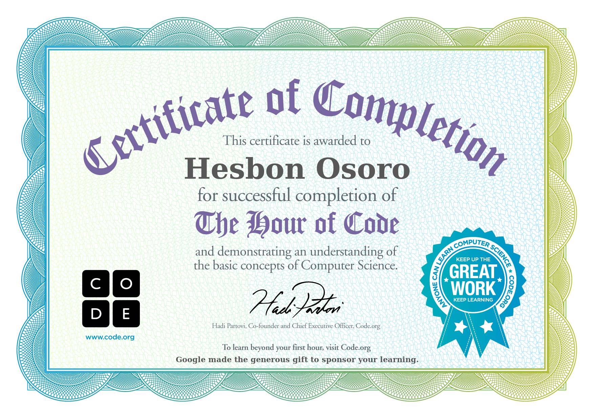
        </a>
        <br />
        <a href="https://code.org/congrats?i=_1_18e783d40c7c6f10271c6612c21a4c65">Verify</a>
      </td>
      <td width="50%"></td>
    </tr>
  </tbody>
</table>

<!-- prettier-ignore-end -->

## 📈 GitHub Activity

<!-- Cards are snapshotted daily into assets/cards/ by .github/workflows/readme-cards.yml -->

<!-- prettier-ignore-start -->

<p align="center">
  <a href="https://github.com/hesbon-osoro?tab=overview">
    
  </a>
</p>

<h3>🏆 Trophies</h3>

<p align="center">
  <a href="https://github.com/hesbon-osoro">
    
  </a>
</p>

<p align="center">
  <a href="https://github.com/hesbon-osoro">
    
  </a>
  <a href="https://github.com/hesbon-osoro">
    
  </a>
</p>

<p align="center">
  <a href="https://github.com/hesbon-osoro/hesbon-osoro">
    
  </a>
  <a href="https://github.com/hesbon-osoro?tab=repositories">
    
  </a>
</p>

<h3>🧩 LeetCode</h3>

<p align="center">
  <a href="https://leetcode.com/hesbon-osoro/">
    
  </a>
  <a href="https://leetcode.com/hesbon-osoro/">
    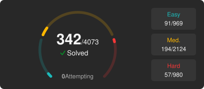
  </a>
</p>

<h3>⏱️ WakaTime</h3>

<p align="center">
  <a href="https://wakatime.com/@wazimu">
    
  </a>
</p>

<p align="center">
  <a href="https://wakatime.com/@26cc90f6-22da-4220-ac7d-f452b6324239">
    
  </a>
</p>

<h3>👀 Unique Views</h3>

<p>
  <a href="https://github.com/hesbon-osoro/wazimu-views-counter">
    
  </a>
  <a href="https://github.com/hesbon-osoro?tab=followers">
    
  </a>
</p>

<!-- prettier-ignore-end -->

### 😂 Here is a random joke for you today


### Star my projects [here](https://github.com/hesbon-osoro?tab=repositories)

## 💼 Open To

**Roles · Offers · Opportunities**: [`Mail`](mailto:hesbonosoro1@gmail.com) me!

- 🌍 Work from home / Remote
- 🧑‍💻 _Freelance_
- 🔐 _CompTIA Ethical Hacking_ · _HackTheBox_ | _HTB_
- ✍️ _Academic Writing_
- 📚 _Cengage/MindTap_ · _zyBooks_
- 📬 Mail me your coding assignment: [osoro@hesbon.dev](mailto:osoro@hesbon.dev)

## 🤝 Let’s Connect

- 📧 Email: [osoro@hesbon.dev](mailto:osoro@hesbon.dev) | [hesbonosoro1@gmail.com](mailto:hesbonosoro1@gmail.com)
- 💼 LinkedIn: [linkedin.com/in/hesbon-osoro](https://www.linkedin.com/in/hesbon-osoro/)
- 🌍 Portfolio: [hesbon.dev](https://hesbon.dev/)
- 🐦 Twitter: [@wazimu_hb](https://twitter.com/wazimu_hb)
- 💻 GitHub: [github.com/hesbon-osoro](https://github.com/hesbon-osoro)

[GoFundMe](https://www.gofundme.com/u/hesbon-osoro)

[](https://www.buymeacoffee.com/wazimu)

OR [`Paypal`](https://www.paypal.com/) use <hesbonosoro1@gmail.com>

⭐️ _Feel free to explore, fork, and collaborate on my projects. Open to freelance, remote roles, and research opportunities._

<!-- Thank you. -->
<h3 align="center">Thank  you</h3>
