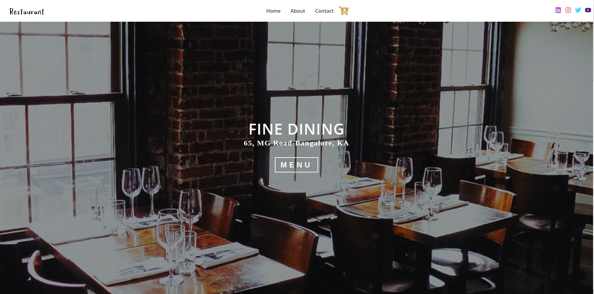
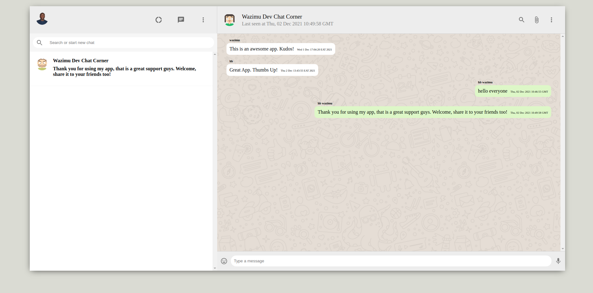
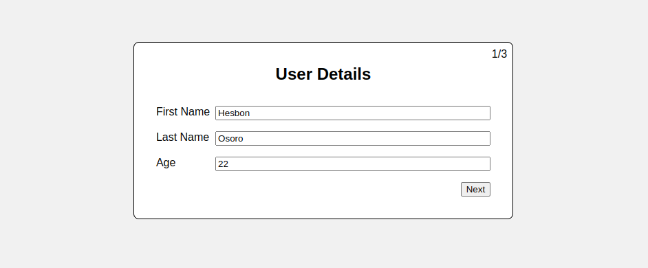
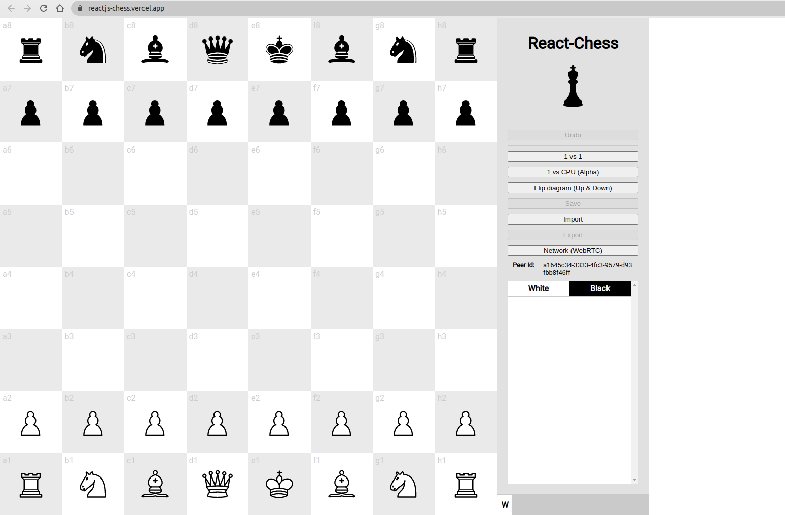
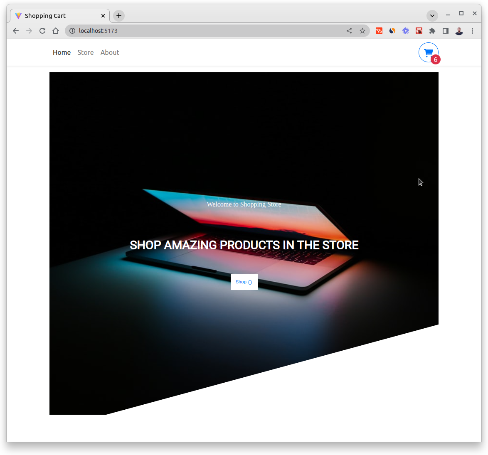
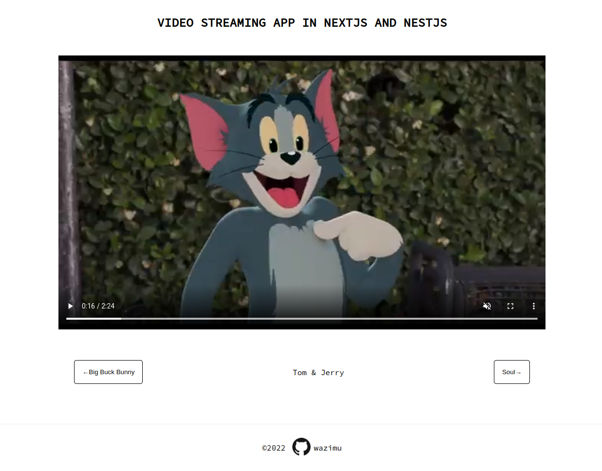
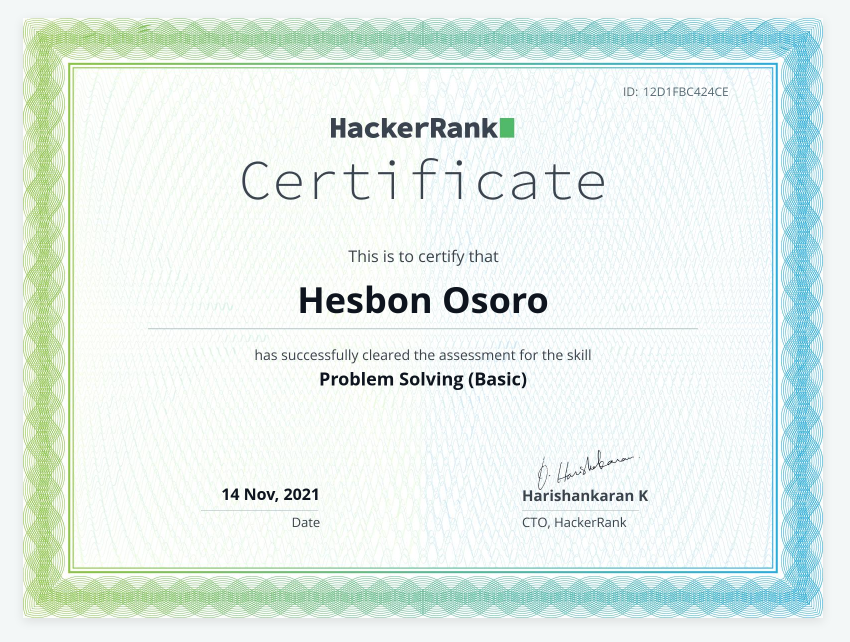
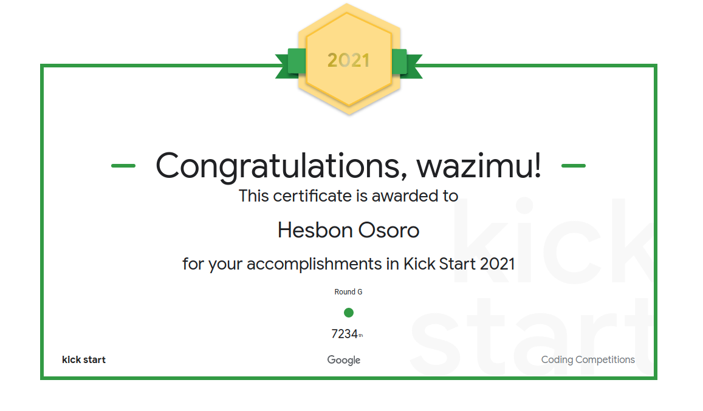

## Hi ,

[](https://hb-wazimu.netlify.app)

[](https://app.netlify.com/sites/hb-wazimu/deploys)

<!-- 

## Check out: -->

Check out my [`Portfolio website`](https://hb-wazimu.netlify.app/).

[Google](https://g.dev/hesbon-osoro) | [GitHub](https://hesbon-osoro.github.io/hesbon-osoro/)

[](https://git.io/typing-svg)

I am a motivated software engineer with 3+ years of experience in building web applications. I don't just write code, I really fancy problem-solving and collaborating with various stakeholders. I am currently looking for new and challenging opportunities that will help me become a better engineer.

In my free time, I enjoy staying up-to-date on tech trends and research, playing chess, and traveling and experiencing new adventures. These interests allow me to have a well-rounded personality and keep my mind sharp and engaged. I am always looking for ways to learn and grow, both personally and professionally.

<!-- An avid programmer and fast learner. Obsessed with detail and quality.
Always trying to improve development and communication processes. I love
simple and elegant solutions to every problem. I am seeking a position in a
growth-oriented company where I can use my skills to the advantage of the
company while having the scope to develop my skills. -->

I have deployed several sites some of which am showcasing in the <a href="#sample-projects">Sample Projects</a> section.

#### Top Technologies

[](#) [](#) [](#) [](#)

### 📊 Monthly development breakdown

<!--START_SECTION:waka-->

```txt
From: 27 April 2024 - To: 27 May 2024

No activity tracked
```

<!--END_SECTION:waka-->

### Experience

<p align="left">
  
  
  
  
  
  
  <!--  -->
  
  
<!--  -->
  
  
  
  
  
</p>

<h2 id="sample-projects">Projects</h2>
<table>
  <tbody>
    <tr>
      <td>
        <a href="https://restaurant-ecommerce.netlify.app/">
          
        </a>
      </td>
      <td>
        <a href="https://restaurant-ecommerce.netlify.app/">Restaurant E-commerce site</a>
          <br />
          <br />
          <a href="https://github.com/hesbon-osoro/restaurant">
            
          </a>
      </td>
      <td>
        <a href="https://hampi-tourism-site-hb.netlify.app/">
          
        </a>
      </td>
      <td>
        <a href="https://hampi-tourism-site-hb.netlify.app/">Tourism Hampi</a>
           <br />
          <br />
          <a href="https://github.com/hesbon-osoro/tourism-hampi">
            
          </a>
      </td>
    </tr>
    <tr>
      <td>
        <a href="https://video-app-hb.netlify.app/">
          
        </a>
      </td>
      <td>
        <a href="https://video-app-hb.netlify.app/">Video App</a>
        <br />
          <br />
          <a href="https://github.com/hesbon-osoro/video-app">
           
          </a>
      </td>
      <td>
        <a href="https://chat-app-merng.netlify.app/">
             
        </a>   
      </td>
      <td>
        <a href="https://chat-app-merng.netlify.app/">Chat App</a>
         <br />
          <br />
          <a href="https://github.com/hesbon-osoro/chat-app-merng-client">
           
          </a>
      </td>
    </tr>
    <tr>
    <td>
      <a href="https://dating-site-frontend.netlify.app/">
        
      </a>
    </td>
    <td>
      <a href="https://dating-site-frontend.netlify.app/">Dating Site</a>
         <br />
          <br />
          <a href="https://github.com/hesbon-osoro/dating-app-frontend">
           
          </a>
    </td>
    <td>
      <a href="https://salad-hb.netlify.app/">
        
      </a>
    </td>
    <td>
      <a href="https://salad-hb.netlify.app/">Salad site</a>
         <br />
          <br />
          <a href="https://github.com/hesbon-osoro/salad">
           
          </a>
    </td>
    </tr>
    <tr>
      <td>
        <a href="https://agency-site-hb.netlify.app/">
          
        </a>
      </td>
      <td>
        <a href="https://agency-site-hb.netlify.app">Agency Site</a>
         <br />
          <br />
          <a href="https://github.com/hesbon-osoro/agency-site">
           
          </a>
      </td>
      <td>
        <a href="https://portfolio-hb.netlify.app/">
          
        </a>
      </td>
      <td>
        <a href="https://portfolio-hb.netlify.app/">Sample Portfolio</a>
         <br />
          <br />
          <a href="https://github.com/hesbon-osoro/portfolio-hb">
           
          </a>
      </td>
    </tr>
     <tr>
       <td>
        <a href="https://recipes-homemade-hb.netlify.app/">
          
        </a>
      </td>
      <td>
        <a href="https://recipes-homemade-hb.netlify.app/">Recipes Homemade</a>
         <br />
          <br />
          <a href="https://github.com/hesbon-osoro/recipes-homemade">
           
          </a>
      </td>
      <td>
        <a href="https://messaging-app-frontend.web.app/">
          
        </a>
      </td>
      <td>
        <a href="https://messaging-app-frontend.web.app/">Messaging App</a>
         <br />
          <br />
          <a href="https://github.com/hesbon-osoro/messaging-app-frontend">
           
          </a>
      </td>        
    </tr>
     <tr>
       <td>
        <a href="https://reactjs-shoppy-admin-dashboard.netlify.app/">
          
        </a>
      </td>
      <td>
        <a href="https://reactjs-shoppy-admin-dashboard.netlify.app/">Shoppy Dashboard</a>
         <br />
          <br />
          <a href="https://github.com/hesbon-osoro/shoppy-admin-dashboard">
           
          </a>
      </td>
      <td>
        <a href="https://simple-multistep-form.netlify.app/">
          
        </a>
      </td>
      <td>
        <a href="https://simple-multistep-form.netlify.app/">Simple Multi-step form</a>
         <br />
          <br />
          <a href="https://github.com/hesbon-osoro/simple-multistep-form">
           
          </a>
      </td>        
    </tr>
    <tr>
       <td>
        <a href="https://react-alarm-clock.netlify.app/">
          
        </a>
      </td>
      <td>
        <a href="https://react-alarm-clock.netlify.app/">Alarm Clock</a>
         <br />
          <br />
          <a href="https://github.com/hesbon-osoro/alarm-clock">
           
          </a>
      </td>
      <td>
        <a href="https://snake-game-ts.netlify.app/">
          
        </a>
      </td>
      <td>
        <a href="https://snake-game-ts.netlify.app/">Snake Game</a>
         <br />
          <br />
          <a href="https://github.com/hesbon-osoro/snake-game">
           
          </a>
      </td>        
    </tr>
    <tr>
       <td>
        <a href="https://reactjs-chess.vercel.app/">
          
        </a>
      </td>
      <td>
        <a href="https://reactjs-chess.vercel.app/">React Chess</a>
         <br />
          <br />
          <a href="https://github.com/hesbon-osoro/react-chess">
           
          </a>
      </td>
      <td>
        <a href="https://reactjs-sort-visualizer.netlify.app/">
          
        </a>
      </td>
      <td>
        <a href="https://reactjs-sort-visualizer.netlify.app/">Sort Visualizer</a>
         <br />
          <br />
          <a href="https://github.com/hesbon-osoro/sort-visualizer">
           
          </a>
      </td>        
    </tr>
    <tr>
       <td>
        <a href="https://reactts-shopping-cart.netlify.app/">
          
        </a>
      </td>
      <td>
        <a href="https://reactts-shopping-cart.netlify.app/">Shopping Cart</a>
         <br />
          <br />
          <a href="https://github.com/hesbon-osoro/shopping-cart">
           
          </a>
      </td>
      <td>
        <a href="https://custom-pagination-react.netlify.app/">
          
        </a>
      </td>
      <td>
        <a href="https://custom-pagination-react.netlify.app/">Custom Pagination</a>
         <br />
          <br />
          <a href="https://github.com/hesbon-osoro/custom-pagination">
           
          </a>
      </td>        
    </tr>
    <tr>
       <td>
        <a href="https://react-custom-select.netlify.app/">
          
        </a>
      </td>
      <td>
        <a href="https://react-custom-select.netlify.app/">Custom Select</a>
         <br />
          <br />
          <a href="https://github.com/hesbon-osoro/react-select">
           
          </a>
      </td>
      <td>
        <a href="https://reactjs-drag-and-drop.netlify.app/">
          
        </a>
      </td>
      <td>
        <a href="https://reactjs-drag-and-drop.netlify.app/">Drag and Drop</a>
         <br />
          <br />
          <a href="https://github.com/hesbon-osoro/drag-and-drop">
           
          </a>
      </td>        
    </tr>
    <tr>
       <td>
        <a href="https://ck-editor-react.netlify.app/">
          
        </a>
      </td>
      <td>
        <a href="https://ck-editor-react.netlify.app/">CK 5 Editor</a>
         <br />
          <br />
          <a href="https://github.com/hesbon-osoro/ck-editor-react">
           
          </a>
      </td>
      <td>
        <a href="https://tic-tac-toe-ts-game.netlify.app/">
          
        </a>
      </td>
      <td>
        <a href="https://tic-tac-toe-ts-game.netlify.app/">Tic Tac Toe</a>
         <br />
          <br />
          <a href="https://github.com/hesbon-osoro/tic-tac-toe">
           
          </a>
      </td>        
    </tr>
    <tr>
       <td>
        <a href="https://face-auth.netlify.app/">
          
        </a>
      </td>
      <td>
        <a href="https://face-auth.netlify.app/">Face Auth</a>
         <br />
          <br />
          <a href="https://github.com/hesbon-osoro/face-auth">
           
          </a>
      </td>
      <td>
        <a href="https://dynamic-next-previous-buttons.vercel.app/">
          
        </a>
      </td>
      <td>
        <a href="https://dynamic-next-previous-buttons.vercel.app/">Dynamic Next/Previous buttons</a>
         <br />
         <br />
         <a href="https://github.com/hesbon-osoro/dynamic-next-previous-buttons">
           
         </a>
      </td>        
    </tr>
    <tr>
      <td>
        <a href="https://nextjs-video-streaming.vercel.app/">
          
        </a>
      </td>
      <td>
        <a href="https://nextjs-video-streaming.vercel.app/">Video Stream</a>
         <br />
          <br />
          <a href="https://github.com/hesbon-osoro/nextjs-video-streaming">
           
          </a>
      </td>
      <td>
        <a href="https://hesbon-osoro.github.io/MindTap/">
          
        </a>
      </td>
      <td>
        <a href="https://hesbon-osoro.github.io/MindTap/">Cengage | MindTap (69 - projects)</a>
         <br />
          <br />
          <a href="https://github.com/hesbon-osoro/MindTap">
           
          </a>
      </td>
    </tr>
    <tr>
      <td>
        <a href="https://follow-for-follow-back.vercel.app/">
          
        </a>
      </td>
      <td>
        <a href="https://follow-for-follow-back.vercel.app/"
          >Follow For Follow Back</a
        >
        <br />
        <br />
        <a
          href="https://github.com/hesbon-osoro/follow-for-follow-back"
        >
          
        </a>
      </td>
    </tr>
    <tr>
      <td colspan="4" align="center">
        CLICK ON THE  ICON TO VIEW THE PROJECT'S REPOSITORY
      </td>
    </tr>
    <tr>
      <td colspan="4" align="center">
       CLICK ON THE PROJECT IMAGE OR THE <a href="#">BLUE LINK</a> TO VISIT THE HOSTED PROJECT
      </td>
    </tr>
  </tbody>
</table>

<br />

  <h2>Certifications</h2>  
<table>
  <tbody>
    <tr>
      <td>
        <a href="https://www.hackerrank.com/certificates/229ef084f60a">
          
        </a>
      </td>
      <td>
        <a href="https://www.hackerrank.com/certificates/229ef084f60a"
          >Verify</a
        >
      </td>
      <td>
        <a href="https://www.hackerrank.com/certificates/12d1fbc424ce">
          
        </a>
      </td>
      <td>
        <a href="https://www.hackerrank.com/certificates/12d1fbc424ce"
          >Verify</a
        >
      </td>
    </tr>
    <tr>
      <td>
        <a href="https://www.codechef.com/certificates/verify">
          
        </a>
      </td>
      <td>
        <a href="https://www.codechef.com/certificates/verify">Verify</a>
        <p><b>Certificate ID:</b> 94a6f28</p>
        <p><b>Username:</b> wazimu</p>
      </td>
      <td>
        <a href="https://hb-wazimu.netlify.app/#certification">
          
        </a>
      </td>
      <td>
        <a href="https://hb-wazimu.netlify.app/#certification">Verify</a>
      </td>
    </tr>
    <tr>
      <td>
        <a
          href="https://www.freecodecamp.org/certification/wazimu/front-end-development-libraries"
        >
          
        </a>
      </td>
      <td>
        <a
          href="https://www.freecodecamp.org/certification/wazimu/front-end-development-libraries"
          >Verify</a
        >
      </td>
      <td>
        <a
          href="https://www.freecodecamp.org/certification/wazimu/javascript-algorithms-and-data-structures"
        >
          
        </a>
      </td>
      <td>
        <a
          href="https://www.freecodecamp.org/certification/wazimu/javascript-algorithms-and-data-structures"
          >Verify</a
        >
      </td>
    </tr>
    <tr>
      <td>
        <a
          href="https://www.freecodecamp.org/certification/wazimu/responsive-web-design"
        >
          
        </a>
      </td>
      <td>
        <a
          href="https://www.freecodecamp.org/certification/wazimu/responsive-web-design"
          >Verify</a
        >
      </td>
      <td>
        <a href="https://hb-wazimu.netlify.app/#certification">
          
        </a>
      </td>
      <td>
        <a href="https://hb-wazimu.netlify.app/#certification">Verify</a>
      </td>
    </tr>
    <tr>
      <td>
        <a href="https://hb-wazimu.netlify.app/#certification">
          
        </a>
      </td>
      <td>
        <a href="https://hb-wazimu.netlify.app/#certification">Verify</a>
      </td>
      <td>
        <a href="https://hb-wazimu.netlify.app/#certification">
          
        </a>
      </td>
      <td>
        <a href="https://hb-wazimu.netlify.app/#certification">Verify</a>
      </td>
    </tr>
    <tr>
    <td>
        <a href="https://hb-wazimu.netlify.app/#certification">
          
        </a>
      </td>
      <td>
        <a href="https://hb-wazimu.netlify.app/#certification">Verify</a>
      </td>
      <td>
        <a href="https://hb-wazimu.netlify.app/#certification">
          
        </a>
      </td>
      <td>
        <a href="https://hb-wazimu.netlify.app/#certification">Verify</a>
      </td>
    </tr>
     <tr>
    <td>
        <a href="https://hb-wazimu.netlify.app/#certification">
          
        </a>
      </td>
      <td>
        <a href="https://code.org/congrats?i=_1_18e783d40c7c6f10271c6612c21a4c65">Verify</a>
      </td>
     </tr>
  </tbody>
</table>
</details>
</h2>

<h3 align="center" style="color:yellow;margin-bottom: 20px;" >Let's Connect </h3>  
<p align='center'>
  <a href="https://www.linkedin.com/in/hesbon-osoro/">
    
  </a>&nbsp;&nbsp;
  <a href="https://instagram.com/wazimu.hb">
            
  </a>&nbsp;&nbsp;
 <a href="https://wa.me/+254792496898">
  
 </a>&nbsp;&nbsp;
 <a href="mailto:hesbonosoro1@gmail.com">
  
 </a>&nbsp;&nbsp;
  <a href="https://t.me/hesbon-osoro">
  
 </a> &nbsp;&nbsp;
</p>

<p align='center'>
  <a href="https://twitter.com/wazimu_hb">
    
  </a>&nbsp;&nbsp;
  <a href="https://github.com/hesbon-osoro">
            
  </a>&nbsp;&nbsp;
 <a href="https://www.reddit.com/user/hesbon-osoro">
  
 </a>&nbsp;&nbsp;
 <a href="https://www.youtube.com/channel/UCgHKQfyNh8thOZtS4kfQG-A">
  
 </a>&nbsp;&nbsp;
</p>

<!-- <h1> Skills</h1>


 -->
<!--
<h2>
  <details>
    <summary>Tools</summary>

    

  </details>
 </h2> -->

<!-- 


 -->

## Contribution Graph

[](https://github.com/ashutosh00710/github-readme-activity-graph)

### 🏆 <!--My Trophies-->

[](https://github.com/hesbon-osoro)

<!--### Github Stats-->

[](https://github.com/hesbon-osoro)

<p></p>

<!--### Github extra pins-->

[](https://github.com/hesbon-osoro/hesbon-osoro&show_owner=true&count_private=true)

[](https://github.com/hesbon-osoro/hesbon-osoro)

[](https://leetcode.com/hesbon-osoro/)

[](https://leetcode.com/hesbon-osoro/)

[](https://wakatime.com/@wazimu)

[](https://wakatime.com/@26cc90f6-22da-4220-ac7d-f452b6324239)

### Unique Views

[](https://github.com/hesbon-osoro/wazimu-views-counter)

<p>
  <a href="https://github.com/hesbon-osoro?tab=followers">
    
  </a>
</p>

### 😂 Here is a random joke for you today: -


<!--

-->

### Star my projects [here](https://github.com/hesbon-osoro?tab=repositories)

<!-- :relaxed:**Follow for Follow back**:relaxed: -->

<Roles || Offers || Opportunities?? [`Mail`](mailto:hesbonosoro1@gmail.com) Me!>

<<---WorkFromHome/ Remote--->>

_Freelance_

<Mail me your coding assignment: hesbonosoro1@gmail.com>

[](https://www.buymeacoffee.com/wazimu)

OR [`Paypal`](https://www.paypal.com/) use <hesbonosoro1@gmail.com>

Thank you.
