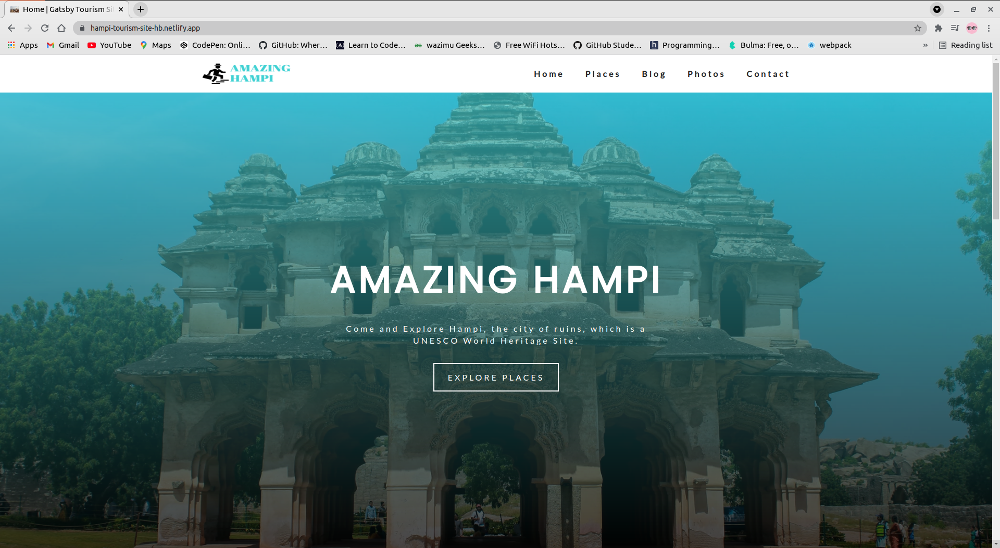
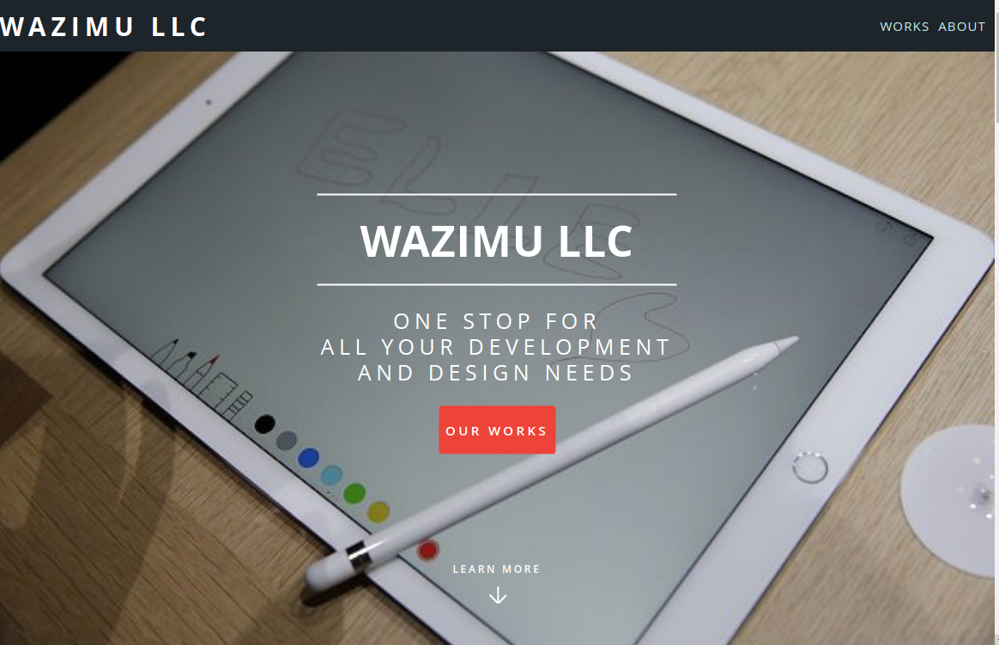
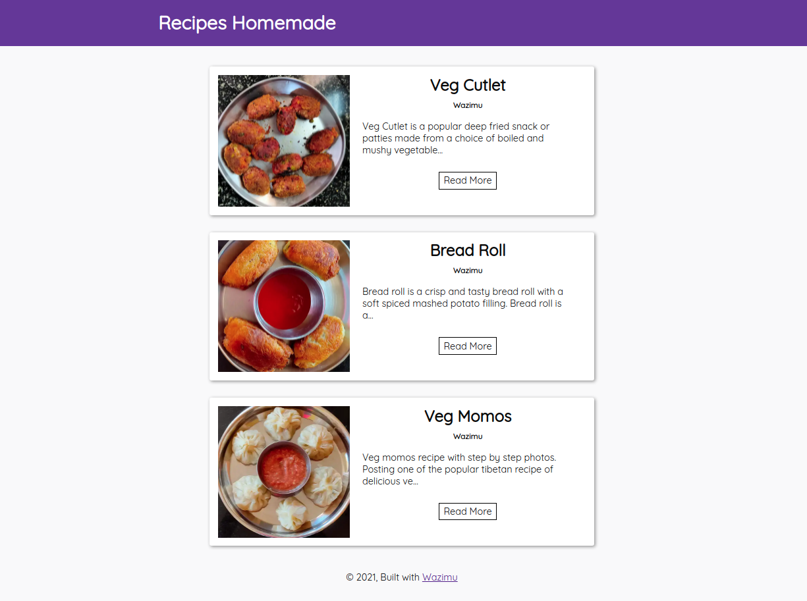
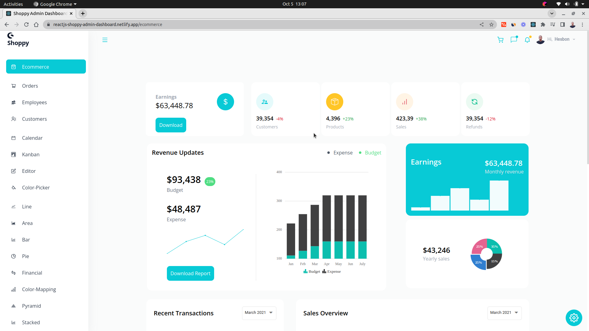
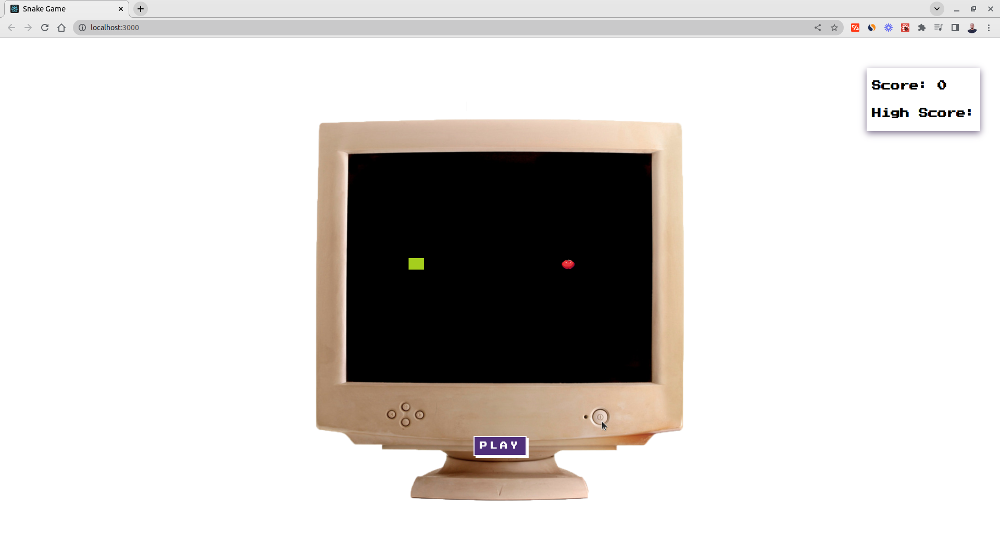
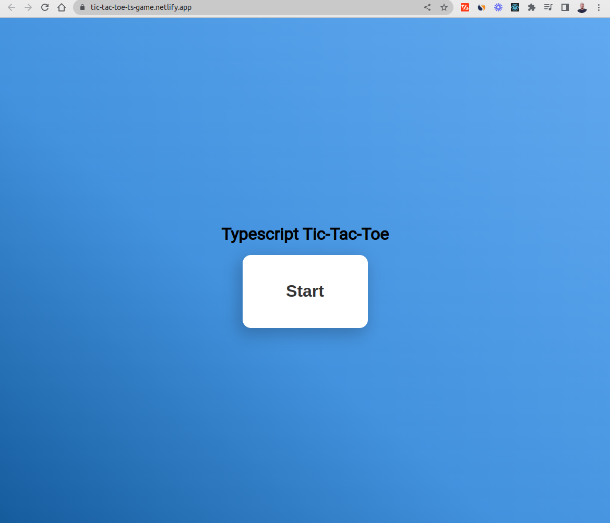
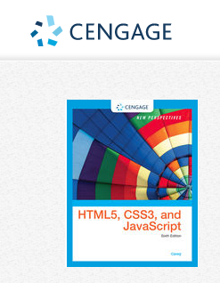
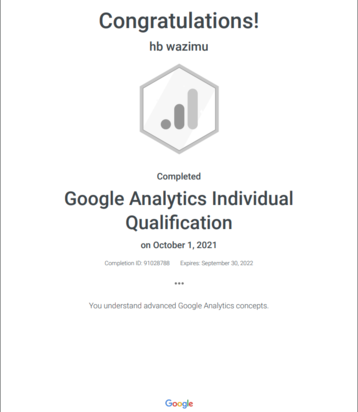

## Hi ,

[](https://git.io/typing-svg)

🚀 **Software Engineer | AI & Cybersecurity Enthusiast | Full-Stack Developer**

> 🛠️ **New**: [Repository Management Tools](./REPO_MANAGEMENT.md) - Automatically clone and manage all portfolio projects

[](https://hb-wazimu.netlify.app)

[](https://hb-wazimu.netlify.app/)

## 👨‍💻 About Me

As a **Software Engineer** with 3+ years in the field, I thrive on the process of transforming complex problems into **impactful, scalable solutions**. My experience spans delivering **production-grade web applications** (featured in [Sample Projects](#sample-projects)) and contributing to cutting-edge **AI model training and data enhancement**.

I view every project as a new challenge and a chance to evolve. I collaborate closely with diverse stakeholders to deliver efficient results, always staying updated on the latest trends and sharing my refined solutions with the wider community.

- 🌐 Delivered 30+ production-ready projects (React, Next.js, Node.js, GraphQL, PostgreSQL, MongoDB).
- 🤖 Contributed to AI model training & dataset validation for research and academic projects.
- 🔐 Self-driven in **CompTIA Ethical Hacking** and **HackTheBox** labs.
- 🎓 Background in mathematics, data modeling, and content evaluation.

## 🛠️ Skills

**Languages & Frameworks:** JavaScript, TypeScript, React, Next.js, Node.js, GraphQL  
**Databases:** PostgreSQL, MongoDB, MySQL, Firebase  
**DevOps & Tools:** Git, Linux, Heroku, Netlify, Docker (basic)  
**Security:** Ethical Hacking (CompTIA), HackTheBox challenges  
**Other:** Academic writing, research, data annotation

<p align="left">
  
  
  
  
  
  
  <!--  -->
  
  
<!--  -->
  
  
  
  
  
</p>

### 📊 Monthly development breakdown

<!--START_SECTION:waka-->

```txt
From: 20 December 2025 - To: 19 January 2026

No activity tracked
```

<!--END_SECTION:waka-->

<h2 id="sample-projects">📂 Featured Projects</h2>
<table>
  <tbody>
    <tr>
      <td width="50%">
        <a href="https://restaurant-ecommerce.netlify.app/">
          
        </a>
        <br />
        <a href="https://restaurant-ecommerce.netlify.app/">Restaurant E-commerce site</a>
        <br />
        <a href="https://github.com/hesbon-osoro/restaurant">
          
        </a>
      </td>
      <td width="50%">
        <a href="https://hampi-tourism-site-hb.netlify.app/">
          
        </a>
        <br />
        <a href="https://hampi-tourism-site-hb.netlify.app/">Tourism Hampi</a>
        <br />
        <a href="https://github.com/hesbon-osoro/tourism-hampi">
          
        </a>
      </td>
    </tr>
    <tr>
      <td width="50%">
        <a href="https://video-app-hb.netlify.app/">
          
        </a>
        <br />
        <a href="https://video-app-hb.netlify.app/">Video App</a>
        <br />
        <a href="https://github.com/hesbon-osoro/video-app">
          
        </a>
      </td>
      <td width="50%">
        <a href="https://chat-app-merng.netlify.app/">
          
        </a>
        <br />
        <a href="https://chat-app-merng.netlify.app/">Chat App</a>
        <br />
        <a href="https://github.com/hesbon-osoro/chat-app-merng-client">
          
        </a>
      </td>
    </tr>
    <tr>
      <td width="50%">
        <a href="https://dating-site-frontend.netlify.app/">
          
        </a>
        <br />
        <a href="https://dating-site-frontend.netlify.app/">Dating Site</a>
        <br />
        <a href="https://github.com/hesbon-osoro/dating-app-frontend">
          
        </a>
      </td>
      <td width="50%">
        <a href="https://salad-hb.netlify.app/">
          
        </a>
        <br />
        <a href="https://salad-hb.netlify.app/">Salad site</a>
        <br />
        <a href="https://github.com/hesbon-osoro/salad">
          
        </a>
      </td>
    </tr>
    <tr>
      <td width="50%">
        <a href="https://agency-site-hb.netlify.app/">
          
        </a>
        <br />
        <a href="https://agency-site-hb.netlify.app/">Agency Site</a>
        <br />
        <a href="https://github.com/hesbon-osoro/agency-site">
          
        </a>
      </td>
      <td width="50%">
        <a href="https://portfolio-hb.netlify.app/">
          
        </a>
        <br />
        <a href="https://portfolio-hb.netlify.app/">Sample Portfolio</a>
        <br />
        <a href="https://github.com/hesbon-osoro/portfolio-hb">
          
        </a>
      </td>
    </tr>
    <tr>
      <td width="50%">
        <a href="https://recipes-homemade-hb.netlify.app/">
          
        </a>
        <br />
        <a href="https://recipes-homemade-hb.netlify.app/">Recipes Homemade</a>
        <br />
        <a href="https://github.com/hesbon-osoro/recipes-homemade">
          
        </a>
      </td>
      <td width="50%">
        <a href="https://messaging-app-frontend.web.app/">
          
        </a>
        <br />
        <a href="https://messaging-app-frontend.web.app/">Messaging App</a>
        <br />
        <a href="https://github.com/hesbon-osoro/messaging-app-frontend">
          
        </a>
      </td>
    </tr>
    <tr>
      <td width="50%">
        <a href="https://reactjs-shoppy-admin-dashboard.netlify.app/">
          
        </a>
        <br />
        <a href="https://reactjs-shoppy-admin-dashboard.netlify.app/">Shoppy Dashboard</a>
        <br />
        <a href="https://github.com/hesbon-osoro/shoppy-admin-dashboard">
          
        </a>
      </td>
      <td width="50%">
        <a href="https://simple-multistep-form.netlify.app/">
          
        </a>
        <br />
        <a href="https://simple-multistep-form.netlify.app/">Simple Multi-step form</a>
        <br />
        <a href="https://github.com/hesbon-osoro/simple-multistep-form">
          
        </a>
      </td>
    </tr>
    <tr>
      <td width="50%">
        <a href="https://react-alarm-clock.netlify.app/">
          
        </a>
        <br />
        <a href="https://react-alarm-clock.netlify.app/">Alarm Clock</a>
        <br />
        <a href="https://github.com/hesbon-osoro/alarm-clock">
          
        </a>
      </td>
      <td width="50%">
        <a href="https://snake-game-ts.netlify.app/">
          
        </a>
        <br />
        <a href="https://snake-game-ts.netlify.app/">Snake Game</a>
        <br />
        <a href="https://github.com/hesbon-osoro/snake-game">
          
        </a>
      </td>
    </tr>
    <tr>
      <td width="50%">
        <a href="https://reactjs-chess.vercel.app/">
          
        </a>
        <br />
        <a href="https://reactjs-chess.vercel.app/">React Chess</a>
        <br />
        <a href="https://github.com/hesbon-osoro/react-chess">
          
        </a>
      </td>
      <td width="50%">
        <a href="https://reactjs-sort-visualizer.netlify.app/">
          
        </a>
        <br />
        <a href="https://reactjs-sort-visualizer.netlify.app/">Sort Visualizer</a>
        <br />
        <a href="https://github.com/hesbon-osoro/sort-visualizer">
          
        </a>
      </td>
    </tr>
    <tr>
      <td width="50%">
        <a href="https://reactts-shopping-cart.netlify.app/">
          
        </a>
        <br />
        <a href="https://reactts-shopping-cart.netlify.app/">Shopping Cart</a>
        <br />
        <a href="https://github.com/hesbon-osoro/shopping-cart">
          
        </a>
      </td>
      <td width="50%">
        <a href="https://custom-pagination-react.netlify.app/">
          
        </a>
        <br />
        <a href="https://custom-pagination-react.netlify.app/">Custom Pagination</a>
        <br />
        <a href="https://github.com/hesbon-osoro/custom-pagination">
          
        </a>
      </td>
    </tr>
    <tr>
      <td width="50%">
        <a href="https://react-custom-select.netlify.app/">
          
        </a>
        <br />
        <a href="https://react-custom-select.netlify.app/">Custom Select</a>
        <br />
        <a href="https://github.com/hesbon-osoro/react-select">
          
        </a>
      </td>
      <td width="50%">
        <a href="https://reactjs-drag-and-drop.netlify.app/">
          
        </a>
        <br />
        <a href="https://reactjs-drag-and-drop.netlify.app/">Drag and Drop</a>
        <br />
        <a href="https://github.com/hesbon-osoro/drag-and-drop">
          
        </a>
      </td>
    </tr>
    <tr>
      <td width="50%">
        <a href="https://ck-editor-react.netlify.app/">
          
        </a>
        <br />
        <a href="https://ck-editor-react.netlify.app/">CK 5 Editor</a>
        <br />
        <a href="https://github.com/hesbon-osoro/ck-editor-react">
          
        </a>
      </td>
      <td width="50%">
        <a href="https://tic-tac-toe-ts-game.netlify.app/">
          
        </a>
        <br />
        <a href="https://tic-tac-toe-ts-game.netlify.app/">Tic Tac Toe</a>
        <br />
        <a href="https://github.com/hesbon-osoro/tic-tac-toe">
          
        </a>
      </td>
    </tr>
    <tr>
      <td width="50%">
        <a href="https://face-auth.netlify.app/">
          
        </a>
        <br />
        <a href="https://face-auth.netlify.app/">Face Auth</a>
        <br />
        <a href="https://github.com/hesbon-osoro/face-auth">
          
        </a>
      </td>
      <td width="50%">
        <a href="https://dynamic-next-previous-buttons.vercel.app/">
          
        </a>
        <br />
        <a href="https://dynamic-next-previous-buttons.vercel.app/">Dynamic Next/Previous buttons</a>
        <br />
        <a href="https://github.com/hesbon-osoro/dynamic-next-previous-buttons">
          
        </a>
      </td>
    </tr>
    <tr>
      <td width="50%">
        <a href="https://nextjs-video-streaming.vercel.app/">
          
        </a>
        <br />
        <a href="https://nextjs-video-streaming.vercel.app/">Video Stream</a>
        <br />
        <a href="https://github.com/hesbon-osoro/nextjs-video-streaming">
          
        </a>
      </td>
      <td width="50%">
        <a href="https://hesbon-osoro.github.io/MindTap/">
          
        </a>
        <br />
        <a href="https://hesbon-osoro.github.io/MindTap/">Cengage | MindTap (69 projects)</a>
        <br />
        <a href="https://github.com/hesbon-osoro/MindTap">
          
        </a>
      </td>
    </tr>
    <tr>
      <td width="50%">
        <a href="https://follow-for-follow-back.vercel.app/">
          
        </a>
        <br />
        <a href="https://follow-for-follow-back.vercel.app/">Follow For Follow Back</a>
        <br />
        <a href="https://github.com/hesbon-osoro/follow-for-follow-back">
          
        </a>
      </td>
      <td width="50%"></td>
    </tr>
    <tr>
      <td colspan="2" align="center">
        CLICK ON THE  ICON TO VIEW THE PROJECT'S REPOSITORY
      </td>
    </tr>
    <tr>
      <td colspan="2" align="center">
        CLICK ON THE PROJECT IMAGE OR THE <a href="#">BLUE LINK</a> TO VISIT THE HOSTED PROJECT
      </td>
    </tr>
  </tbody>
</table>

<br />

  <h2>🎓 Certifications</h2>  
<table>
  <tbody>
    <tr>
      <td width="50%">
        <a href="https://www.hackerrank.com/certificates/229ef084f60a">
          
        </a>
        <br />
        <a href="https://www.hackerrank.com/certificates/229ef084f60a">Verify</a>
      </td>
      <td width="50%">
        <a href="https://www.hackerrank.com/certificates/12d1fbc424ce">
          
        </a>
        <br />
        <a href="https://www.hackerrank.com/certificates/12d1fbc424ce">Verify</a>
      </td>
    </tr>
    <tr>
      <td width="50%">
        <a href="https://www.codechef.com/certificates/verify">
          
        </a>
        <br />
        <a href="https://www.codechef.com/certificates/verify">Verify</a>
        <p><b>Certificate ID:</b> 94a6f28</p>
        <p><b>Username:</b> wazimu</p>
      </td>
      <td width="50%">
        <a href="https://hb-wazimu.netlify.app/#certification">
          
        </a>
        <br />
        <a href="https://hb-wazimu.netlify.app/#certification">Verify</a>
      </td>
    </tr>
    <tr>
      <td width="50%">
        <a
          href="https://www.freecodecamp.org/certification/wazimu/front-end-development-libraries"
        >
          
        </a>
        <br />
        <a
          href="https://www.freecodecamp.org/certification/wazimu/front-end-development-libraries"
          >Verify</a
        >
      </td>
      <td width="50%">
        <a
          href="https://www.freecodecamp.org/certification/wazimu/javascript-algorithms-and-data-structures"
        >
          
        </a>
        <br />
        <a
          href="https://www.freecodecamp.org/certification/wazimu/javascript-algorithms-and-data-structures"
          >Verify</a
        >
      </td>
    </tr>
    <tr>
      <td width="50%">
        <a
          href="https://www.freecodecamp.org/certification/wazimu/responsive-web-design"
        >
          
        </a>
        <br />
        <a
          href="https://www.freecodecamp.org/certification/wazimu/responsive-web-design"
          >Verify</a
        >
      </td>
      <td width="50%">
        <a href="https://hb-wazimu.netlify.app/#certification">
          
        </a>
        <br />
        <a href="https://hb-wazimu.netlify.app/#certification">Verify</a>
      </td>
    </tr>
    <tr>
      <td width="50%">
        <a href="https://hb-wazimu.netlify.app/#certification">
          
        </a>
        <br />
        <a href="https://hb-wazimu.netlify.app/#certification">Verify</a>
      </td>
      <td width="50%">
        <a href="https://hb-wazimu.netlify.app/#certification">
          
        </a>
        <br />
        <a href="https://hb-wazimu.netlify.app/#certification">Verify</a>
      </td>
    </tr>
    <tr>
      <td width="50%">
        <a href="https://hb-wazimu.netlify.app/#certification">
          
        </a>
        <br />
        <a href="https://hb-wazimu.netlify.app/#certification">Verify</a>
      </td>
      <td width="50%">
        <a href="https://hb-wazimu.netlify.app/#certification">
          
        </a>
        <br />
        <a href="https://hb-wazimu.netlify.app/#certification">Verify</a>
      </td>
    </tr>
    <tr>
      <td width="50%">
        <a href="https://hb-wazimu.netlify.app/#certification">
          
        </a>
        <br />
        <a href="https://code.org/congrats?i=_1_18e783d40c7c6f10271c6612c21a4c65">Verify</a>
      </td>
      <td width="50%"></td>
    </tr>
  </tbody>
</table>
</details>
</h2>

## Contribution Graph

[](https://github.com/ashutosh00710/github-readme-activity-graph)

### 🏆 <!--My Trophies-->

[](https://github.com/hesbon-osoro)

<!--### Github Stats-->

[](https://github.com/hesbon-osoro)

<p></p>

<!--### Github extra pins-->

[](https://github.com/hesbon-osoro/hesbon-osoro&show_owner=true&count_private=true)

[](https://github.com/hesbon-osoro/hesbon-osoro)

[](https://leetcode.com/hesbon-osoro/)

[](https://leetcode.com/hesbon-osoro/)

[](https://wakatime.com/@wazimu)

[](https://wakatime.com/@26cc90f6-22da-4220-ac7d-f452b6324239)

### Unique Views

[](https://github.com/hesbon-osoro/wazimu-views-counter)

<p>
  <a href="https://github.com/hesbon-osoro?tab=followers">
    
  </a>
</p>

### 😂 Here is a random joke for you today: -


### Star my projects [here](https://github.com/hesbon-osoro?tab=repositories)

<Roles || Offers || Opportunities?? [`Mail`](mailto:hesbonosoro1@gmail.com) Me!>

<<---WorkFromHome/ Remote--->>

_Freelance_

_CompTIA Ethical Hacking_

_HackTheBox_ | _HTB_

_Academic Writing_

_Cengage/MindTap_

_zyBooks_

<Mail me your coding assignment: hesbonosoro1@gmail.com>

## 🤝 Let’s Connect

- 📧 Email: [hesbonosoro1@gmail.com](mailto:hesbonosoro1@gmail.com)
- 💼 LinkedIn: [linkedin.com/in/hesbon-osoro](https://www.linkedin.com/in/hesbon-osoro/)
- 🌍 Portfolio: [hb-wazimu.netlify.app](https://hb-wazimu.netlify.app/)
- 🐦 Twitter: [@wazimu_hb](https://twitter.com/wazimu_hb)
- 💻 GitHub: [github.com/hesbon-osoro](https://github.com/hesbon-osoro)

[GoFundMe](https://www.gofundme.com/u/hesbon-osoro)

[](https://www.buymeacoffee.com/wazimu)

OR [`Paypal`](https://www.paypal.com/) use <hesbonosoro1@gmail.com>

⭐️ _Feel free to explore, fork, and collaborate on my projects. Open to freelance, remote roles, and research opportunities._

<!-- Thank you. -->
<h3 align="center" style="color:yellow;margin-bottom: 20px;" >Thankyou</h3>
